# README + Knowledge Graph Implementation Plan

> **For agentic workers:** REQUIRED SUB-SKILL: Use superpowers:subagent-driven-development (recommended) or superpowers:executing-plans to implement this plan task-by-task. Steps use checkbox (`- [ ]`) syntax for tracking.

**Goal:** Add `README.md` (static Mermaid navigation index) and `graph.html` (interactive D3.js force-directed knowledge graph) to the repo root, turning 1,500+ scattered JS solutions into a visually navigable knowledge system.

**Architecture:** Two self-contained files at repo root. `graph.html` is a single-file D3.js app with no build step. `README.md` uses GitHub-native Mermaid for static diagrams and links to `graph.html` for interactivity. No prose, no complexity tables — pure navigation.

**Tech Stack:** Markdown + Mermaid (GitHub-rendered), D3.js v7 (CDN, `https://d3js.org/d3.v7.min.js`), vanilla HTML/CSS/JS.

---

## File Map

| File | Action | Responsibility |
|---|---|---|
| `graph.html` | Create | Interactive D3 force-directed knowledge graph |
| `README.md` | Create | Static Mermaid overview + per-section sub-graphs + folder navigation links |
| `.gitignore` | Modify | Add `.superpowers/` entry |

---

## Task 1: Create `graph.html`

**Files:**
- Create: `graph.html` (repo root)

- [ ] **Step 1: Create the file with complete D3 implementation**

Create `/Users/mingyueliu/Documents/GitHub/DataStructure-Algo/graph.html` with this exact content:

```html
<!DOCTYPE html>
<html lang="en">
<head>
<meta charset="UTF-8">
<title>DataStructure-Algo — Knowledge Graph</title>
<script src="https://d3js.org/d3.v7.min.js"></script>
<style>
  * { margin: 0; padding: 0; box-sizing: border-box; }
  body { background: #0d1117; font-family: -apple-system, BlinkMacSystemFont, 'Segoe UI', sans-serif; color: #e6edf3; overflow: hidden; }

  #header { position: fixed; top: 0; left: 0; right: 0; z-index: 100; padding: 14px 24px; background: rgba(13,17,23,0.92); backdrop-filter: blur(10px); border-bottom: 1px solid #21262d; display: flex; align-items: center; gap: 16px; flex-wrap: wrap; }
  #header h1 { font-size: 15px; font-weight: 600; color: #f0f6fc; }
  .badge { font-size: 11px; padding: 3px 10px; border-radius: 12px; font-weight: 500; white-space: nowrap; }
  .badge-ds   { background: rgba(56,139,253,0.15); color: #58a6ff; border: 1px solid rgba(56,139,253,0.3); }
  .badge-algo { background: rgba(63,185,80,0.15);  color: #3fb950; border: 1px solid rgba(63,185,80,0.3); }
  .badge-sub  { background: rgba(210,168,255,0.15);color: #d2a8ff; border: 1px solid rgba(210,168,255,0.3); }
  #header .hint { font-size: 11px; color: #484f58; margin-left: auto; }

  #legend { position: fixed; bottom: 24px; left: 24px; z-index: 100; background: rgba(22,27,34,0.95); border: 1px solid #30363d; border-radius: 8px; padding: 12px 16px; }
  #legend h4 { font-size: 10px; color: #8b949e; text-transform: uppercase; letter-spacing: 0.5px; margin-bottom: 8px; }
  .legend-item { display: flex; align-items: center; gap: 8px; margin-bottom: 5px; font-size: 12px; color: #c9d1d9; }
  .legend-dot { width: 10px; height: 10px; border-radius: 50%; flex-shrink: 0; }

  #tooltip { position: fixed; z-index: 200; background: rgba(22,27,34,0.97); border: 1px solid #30363d; border-radius: 8px; padding: 10px 14px; font-size: 12px; pointer-events: none; opacity: 0; transition: opacity 0.15s; max-width: 220px; }
  #tooltip .t-title { font-weight: 600; color: #f0f6fc; margin-bottom: 3px; font-size: 13px; }
  #tooltip .t-type  { font-size: 11px; margin-bottom: 5px; }
  #tooltip .t-meta  { color: #8b949e; font-size: 11px; line-height: 1.6; }

  svg { display: block; }
  .link { stroke-opacity: 0.35; stroke-width: 1.5; transition: stroke-opacity 0.15s, stroke-width 0.15s; }
  .link.hi  { stroke-opacity: 0.9; stroke-width: 2.5; }
  .link.dim { stroke-opacity: 0.04; }

  .node circle { cursor: grab; }
  .node circle:active { cursor: grabbing; }
  .node.dim circle { opacity: 0.12; }
  .node.dim text   { opacity: 0.08; }
  .node.hi  circle { filter: brightness(1.35) drop-shadow(0 0 6px currentColor); }
</style>
</head>
<body>

<div id="header">
  <h1>DataStructure-Algo — Knowledge Graph</h1>
  <span class="badge badge-ds">● Data Structure</span>
  <span class="badge badge-algo">● Algorithm</span>
  <span class="badge badge-sub">● Sub-technique</span>
  <span class="hint">Drag nodes · Hover to highlight · Scroll to zoom</span>
</div>

<div id="legend">
  <h4>Node size = file count</h4>
  <div class="legend-item"><div class="legend-dot" style="background:#58a6ff"></div>Data Structure</div>
  <div class="legend-item"><div class="legend-dot" style="background:#3fb950"></div>Algorithm Technique</div>
  <div class="legend-item"><div class="legend-dot" style="background:#d2a8ff"></div>Sub-technique</div>
</div>

<div id="tooltip">
  <div class="t-title" id="tt-title"></div>
  <div class="t-type"  id="tt-type"></div>
  <div class="t-meta"  id="tt-meta"></div>
</div>

<svg id="graph"></svg>

<script>
const W = window.innerWidth, H = window.innerHeight;
const svg = d3.select('#graph').attr('width', W).attr('height', H);
const g   = svg.append('g');
svg.call(d3.zoom().scaleExtent([0.25, 4]).on('zoom', e => g.attr('transform', e.transform)));

// ── DATA ────────────────────────────────────────────────────────────────────
const nodes = [
  // Data Structures
  { id:'BinaryTree',    type:'ds',   label:'Binary Tree',         files:94,  color:'#58a6ff' },
  { id:'Graph',         type:'ds',   label:'Graph',               files:43,  color:'#58a6ff' },
  { id:'Array',         type:'ds',   label:'Array',               files:34,  color:'#58a6ff' },
  { id:'Matrix',        type:'ds',   label:'Matrix',              files:38,  color:'#58a6ff' },
  { id:'StackQueue',    type:'ds',   label:'Stack / Queue',       files:61,  color:'#58a6ff' },
  { id:'LinkedList',    type:'ds',   label:'Linked List',         files:31,  color:'#58a6ff' },
  { id:'Heap',          type:'ds',   label:'Heap',                files:19,  color:'#58a6ff' },
  { id:'Trie',          type:'ds',   label:'Trie',                files:8,   color:'#58a6ff' },
  { id:'String',        type:'ds',   label:'String',              files:7,   color:'#58a6ff' },
  // Algorithm Techniques
  { id:'DFS',           type:'algo', label:'DFS',                 files:113, color:'#3fb950' },
  { id:'BFS',           type:'algo', label:'BFS',                 files:52,  color:'#3fb950' },
  { id:'DP',            type:'algo', label:'Dynamic Prog.',       files:98,  color:'#3fb950' },
  { id:'Backtracking',  type:'algo', label:'Backtracking',        files:59,  color:'#3fb950' },
  { id:'TwoPointers',   type:'algo', label:'Two Pointers',        files:142, color:'#3fb950' },
  { id:'Greedy',        type:'algo', label:'Greedy',              files:25,  color:'#3fb950' },
  { id:'Sort',          type:'algo', label:'Sorting',             files:20,  color:'#3fb950' },
  { id:'HashTable',     type:'algo', label:'Hash Table',          files:31,  color:'#3fb950' },
  { id:'BinarySearch',  type:'algo', label:'Binary Search',       files:22,  color:'#3fb950' },
  { id:'Recursion',     type:'algo', label:'Recursion',           files:58,  color:'#3fb950' },
  // Sub-techniques
  { id:'SlidingWindow', type:'sub',  label:'Sliding Window',      files:17,  color:'#d2a8ff' },
  { id:'MonoStack',     type:'sub',  label:'Monotonic Stack',     files:8,   color:'#d2a8ff' },
  { id:'UnionFind',     type:'sub',  label:'Union Find',          files:10,  color:'#d2a8ff' },
  { id:'Dijkstra',      type:'sub',  label:'Dijkstra',            files:5,   color:'#d2a8ff' },
  { id:'PrefixSum',     type:'sub',  label:'Prefix Sum',          files:12,  color:'#d2a8ff' },
  { id:'TopoSort',      type:'sub',  label:'Topo Sort',           files:6,   color:'#d2a8ff' },
];

// Compute radius from file count
nodes.forEach(n => { n.r = Math.max(14, Math.sqrt(n.files) * 3.6); });

const links = [
  // BinaryTree
  { s:'BinaryTree',  t:'DFS',          rel:'traversal' },
  { s:'BinaryTree',  t:'BFS',          rel:'level-order' },
  { s:'BinaryTree',  t:'DP',           rel:'tree DP' },
  { s:'BinaryTree',  t:'Recursion',    rel:'core pattern' },
  { s:'BinaryTree',  t:'BinarySearch', rel:'BST search' },
  // Graph
  { s:'Graph',       t:'DFS',          rel:'traversal' },
  { s:'Graph',       t:'BFS',          rel:'traversal' },
  { s:'Graph',       t:'UnionFind',    rel:'MST / components' },
  { s:'Graph',       t:'Dijkstra',     rel:'shortest path' },
  { s:'Graph',       t:'TopoSort',     rel:'ordering' },
  // Array
  { s:'Array',       t:'TwoPointers',  rel:'search / shrink' },
  { s:'Array',       t:'SlidingWindow',rel:'subarray' },
  { s:'Array',       t:'BinarySearch', rel:'sorted array' },
  { s:'Array',       t:'PrefixSum',    rel:'range query' },
  { s:'Array',       t:'DP',           rel:'sequence DP' },
  { s:'Array',       t:'Greedy',       rel:'intervals' },
  { s:'Array',       t:'Sort',         rel:'ordering' },
  { s:'Array',       t:'HashTable',    rel:'lookup' },
  // Matrix
  { s:'Matrix',      t:'DFS',          rel:'islands' },
  { s:'Matrix',      t:'BFS',          rel:'shortest path' },
  { s:'Matrix',      t:'Backtracking', rel:'N-Queens / Sudoku' },
  { s:'Matrix',      t:'DP',           rel:'grid DP' },
  { s:'Matrix',      t:'PrefixSum',    rel:'2D prefix' },
  // Stack & Queue
  { s:'StackQueue',  t:'MonoStack',    rel:'next greater' },
  { s:'StackQueue',  t:'BFS',          rel:'queue → BFS' },
  { s:'StackQueue',  t:'DFS',          rel:'iterative DFS' },
  { s:'StackQueue',  t:'Greedy',       rel:'priority queue' },
  // Linked List
  { s:'LinkedList',  t:'TwoPointers',  rel:'fast/slow pointers' },
  { s:'LinkedList',  t:'Recursion',    rel:'reversal' },
  // Heap
  { s:'Heap',        t:'Greedy',       rel:'top-K' },
  { s:'Heap',        t:'Sort',         rel:'heap sort' },
  { s:'Heap',        t:'Dijkstra',     rel:'priority queue base' },
  // Trie
  { s:'Trie',        t:'DFS',          rel:'word search' },
  { s:'Trie',        t:'Backtracking', rel:'word construction' },
  { s:'Trie',        t:'HashTable',    rel:'prefix storage' },
  // String
  { s:'String',      t:'TwoPointers',  rel:'palindrome' },
  { s:'String',      t:'DP',           rel:'edit distance / LCS' },
  { s:'String',      t:'Backtracking', rel:'partition' },
  { s:'String',      t:'HashTable',    rel:'anagram' },
  // Sub-technique relationships
  { s:'TwoPointers', t:'SlidingWindow',rel:'specialization' },
  { s:'Dijkstra',    t:'BFS',          rel:'weighted BFS' },
  { s:'TopoSort',    t:'DFS',          rel:'DFS-based' },
  { s:'TopoSort',    t:'BFS',          rel:"Kahn's algo" },
];

// Build adjacency for hover
const adj = {};
links.forEach(l => {
  (adj[l.s] = adj[l.s] || []).push(l.t);
  (adj[l.t] = adj[l.t] || []).push(l.s);
});

// ── SIMULATION ──────────────────────────────────────────────────────────────
const edgeData = links.map(l => ({ source: l.s, target: l.t, rel: l.rel }));

const sim = d3.forceSimulation(nodes)
  .force('link',      d3.forceLink(edgeData).id(d => d.id).distance(d => d.source.r + d.target.r + 55).strength(0.35))
  .force('charge',    d3.forceManyBody().strength(d => -d.r * 30))
  .force('center',    d3.forceCenter(W / 2, H / 2))
  .force('collision', d3.forceCollide().radius(d => d.r + 12));

// ── DRAW ─────────────────────────────────────────────────────────────────────
const linkSel = g.append('g')
  .selectAll('line').data(edgeData).join('line')
  .attr('class', 'link')
  .attr('stroke', '#30363d');

const nodeSel = g.append('g')
  .selectAll('.node').data(nodes).join('g')
  .attr('class', 'node')
  .call(d3.drag()
    .on('start', (e, d) => { if (!e.active) sim.alphaTarget(0.3).restart(); d.fx = d.x; d.fy = d.y; })
    .on('drag',  (e, d) => { d.fx = e.x; d.fy = e.y; })
    .on('end',   (e, d) => { if (!e.active) sim.alphaTarget(0); d.fx = null; d.fy = null; }));

nodeSel.append('circle')
  .attr('r', d => d.r)
  .attr('fill',         d => d.color + '1a')
  .attr('stroke',       d => d.color)
  .attr('stroke-width', 1.8);

nodeSel.each(function(d) {
  const lines = d.label.split(' / ');
  const el = d3.select(this);
  const fs = Math.max(9, d.r * 0.37);
  if (lines.length === 1) {
    el.append('text').text(d.label)
      .attr('font-size', fs).attr('fill', '#e6edf3')
      .attr('text-anchor', 'middle').attr('dominant-baseline', 'central');
  } else {
    lines.forEach((line, i) => {
      el.append('text').text(line)
        .attr('font-size', fs - 1).attr('fill', '#e6edf3')
        .attr('text-anchor', 'middle').attr('dominant-baseline', 'central')
        .attr('dy', (i - (lines.length - 1) / 2) * (fs + 2));
    });
  }
});

// ── HOVER ────────────────────────────────────────────────────────────────────
const tip = document.getElementById('tooltip');
nodeSel
  .on('mouseenter', function(e, d) {
    const nbrs = new Set([d.id, ...(adj[d.id] || [])]);
    nodeSel.classed('hi',  n => n.id === d.id);
    nodeSel.classed('dim', n => !nbrs.has(n.id));
    linkSel.classed('hi',  l => l.source.id === d.id || l.target.id === d.id);
    linkSel.classed('dim', l => l.source.id !== d.id && l.target.id !== d.id);

    document.getElementById('tt-title').textContent = d.label;
    const typeLabel = d.type === 'ds' ? '📦 Data Structure' : d.type === 'algo' ? '⚙️ Algorithm Technique' : '🔧 Sub-technique';
    const tt = document.getElementById('tt-type');
    tt.textContent = typeLabel; tt.style.color = d.color;
    document.getElementById('tt-meta').textContent =
      `${d.files} files · ${(adj[d.id] || []).length} connections`;
    tip.style.opacity = 1;
    tip.style.left = (e.pageX + 14) + 'px';
    tip.style.top  = (e.pageY - 10) + 'px';
  })
  .on('mousemove', e => { tip.style.left = (e.pageX + 14) + 'px'; tip.style.top = (e.pageY - 10) + 'px'; })
  .on('mouseleave', () => {
    nodeSel.classed('hi dim', false);
    linkSel.classed('hi dim', false);
    tip.style.opacity = 0;
  });

sim.on('tick', () => {
  linkSel
    .attr('x1', d => d.source.x).attr('y1', d => d.source.y)
    .attr('x2', d => d.target.x).attr('y2', d => d.target.y);
  nodeSel.attr('transform', d => `translate(${d.x},${d.y})`);
});
</script>
</body>
</html>
```

- [ ] **Step 2: Open in browser and verify**

```bash
open /Users/mingyueliu/Documents/GitHub/DataStructure-Algo/graph.html
```

Expected: Dark background, 25 labeled nodes visible, edges between them. Drag a node — it moves. Hover a node — non-connected nodes dim and a tooltip appears showing file count and connection count. Scroll — zooms in/out.

- [ ] **Step 3: Commit**

```bash
git add graph.html
git commit -m "add interactive D3 knowledge graph (graph.html)"
```

---

## Task 2: `README.md` — Header + Overview Graph + Quick Navigation

**Files:**
- Create: `README.md` (repo root)

- [ ] **Step 1: Create README.md with header and overview Mermaid graph**

Create `/Users/mingyueliu/Documents/GitHub/DataStructure-Algo/README.md`:

```markdown
# DataStructure-Algo

1,500+ LeetCode solutions in JavaScript, organized by data structure and algorithm technique.

[](./graph.html)

> **[→ Open Interactive Knowledge Graph](./graph.html)** — drag nodes, hover to highlight connections

---

## Overview

How data structures and algorithm techniques connect across this repo:

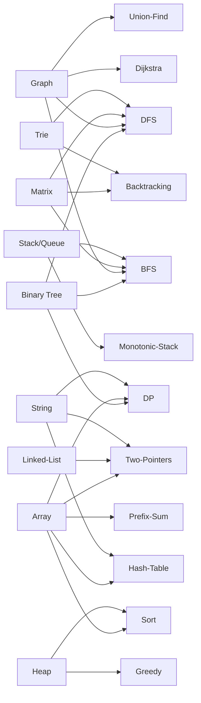
```mermaid
graph LR
  BT[Binary Tree] --> DFS & BFS & DP
  G[Graph]        --> DFS & BFS & UF[Union-Find] & Dijkstra
  Arr[Array]      --> TP[Two-Pointers] & PS[Prefix-Sum] & DP & Sort & Hash[Hash-Table]
  Mat[Matrix]     --> DFS & BFS & BK[Backtracking]
  SQ[Stack/Queue] --> MonoStack[Monotonic-Stack] & BFS
  LL[Linked-List] --> TP
  Heap            --> Greedy & Sort
  Trie            --> DFS & BK
  Str[String]     --> TP & DP & Hash
```
(triple backtick here to close the mermaid block)

---

## Quick Navigation

**Data Structures**
[Binary Tree](#binary-tree--94-files) · [Graph](#graph--43-files) · [Stack & Queue](#stack--queue--61-files) · [Linked List](#linked-list--31-files) · [Array / Prefix Sum](#array--prefix-sum--34-files) · [Matrix](#matrix--38-files) · [Heap](#heap--19-files) · [Trie](#trie--8-files) · [String](#string--7-files)

**Algorithm Techniques**
[DFS](#dfs--113-files) · [BFS](#bfs--52-files) · [Two Pointers](#two-pointers--142-files) · [Dynamic Programming](#dynamic-programming--98-files) · [Backtracking](#backtracking--59-files) · [Greedy](#greedy--25-files) · [Sorting](#sorting--20-files) · [Hash Table](#hash-table--31-files)

**[LeetCode Index](#leetcode-index)**

---
```

- [ ] **Step 2: Verify Mermaid renders**

Push to GitHub or preview locally with a Mermaid-aware tool (e.g., VS Code Markdown Preview Enhanced extension).

Expected: A left-to-right graph where `Binary Tree`, `Graph`, `Array`, etc. each fan out to shared algorithm nodes like `DFS`, `BFS`, `DP`. Shared targets (e.g., `DFS`) appear as a single node with multiple incoming edges — showing the cross-DS connections.

- [ ] **Step 3: Commit**

```bash
git add README.md
git commit -m "add README header, overview Mermaid graph, quick navigation"
```

---

## Task 3: `README.md` — Binary Tree + Graph Sections

**Files:**
- Modify: `README.md`

- [ ] **Step 1: Append Binary Tree section**

Append to `README.md`:

```markdown
---

## Data Structures

### Binary Tree · `94 files`

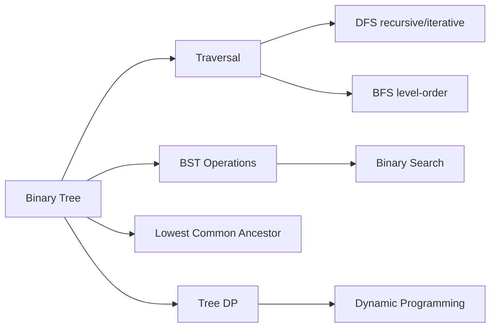
```mermaid
graph LR
  BT[Binary Tree] --> Traversal
  BT --> BST[BST Operations]
  BT --> LCA[Lowest Common Ancestor]
  BT --> TreeDP[Tree DP]
  Traversal --> DFS[DFS recursive/iterative]
  Traversal --> BFS[BFS level-order]
  BST --> BinarySearch[Binary Search]
  TreeDP --> DP[Dynamic Programming]
```
(close mermaid)

| Subcategory | Path |
|---|---|
| Traversal templates (recursive + iterative) | [数据结构/BinaryTree二叉树/遍历模版](./数据结构/BinaryTree二叉树/遍历模版) |
| Tree properties & queries | [数据结构/BinaryTree二叉树/二叉树的属性](./数据结构/BinaryTree二叉树/二叉树的属性) |
| Tree construction & modification | [数据结构/BinaryTree二叉树/二叉树的修改和构造](./数据结构/BinaryTree二叉树/二叉树的修改和构造) |
| BST — properties & validation | [数据结构/BinaryTree二叉树/BST(二叉搜索树)的属性](./数据结构/BinaryTree二叉树/BST(二叉搜索树)的属性) |
| BST — insertion, deletion, construction | [数据结构/BinaryTree二叉树/BST(二叉搜索树)的修改和构造](./数据结构/BinaryTree二叉树/BST(二叉搜索树)的修改和构造) |
| Lowest Common Ancestor (LCA) | [数据结构/BinaryTree二叉树/二叉树最近公共祖先问题(LCA)](./数据结构/BinaryTree二叉树/二叉树最近公共祖先问题\(LCA\)) |
| DFS problems | [算法思想/DFS/DFS in 二叉树 ](./算法思想/DFS/DFS%20in%20二叉树%20) |
| BFS problems | [算法思想/BFS/BFS 遍历 二叉树](./算法思想/BFS/BFS%20遍历%20二叉树) |
```

- [ ] **Step 2: Append Graph section**

```markdown
### Graph · `43 files`

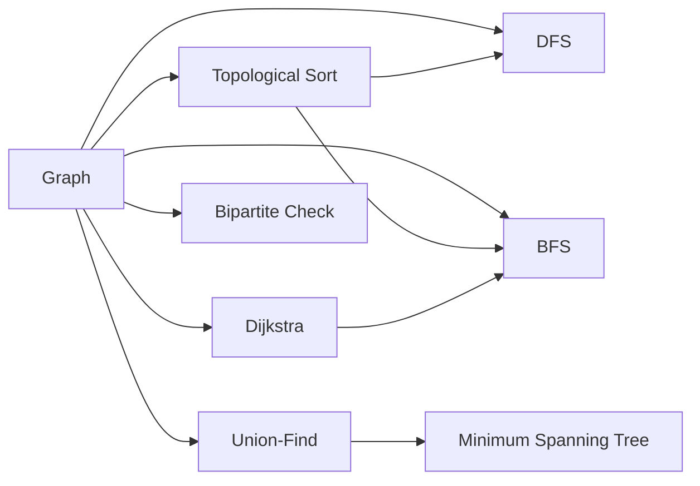
```mermaid
graph LR
  G[Graph] --> DFS & BFS
  G --> UF[Union-Find]
  G --> Dijk[Dijkstra]
  G --> Topo[Topological Sort]
  G --> Bipartite[Bipartite Check]
  Topo --> DFS
  Topo --> BFS
  Dijk --> BFS
  UF --> MST[Minimum Spanning Tree]
```
(close mermaid)

| Subcategory | Path |
|---|---|
| BFS traversal | [数据结构/Graph/BFS遍历](./数据结构/Graph/BFS遍历) |
| DFS traversal | [数据结构/Graph/DFS遍历](./数据结构/Graph/DFS遍历) |
| Union-Find (Disjoint Set) | [数据结构/Graph/并查集(Union Find)](./数据结构/Graph/并查集(Union%20Find)) |
| Shortest / longest path (Dijkstra, BFS) | [数据结构/Graph/最短(长)路径](./数据结构/Graph/最短(长)路径) |
| Cycle detection + topological sort | [数据结构/Graph/环检测_topologicalSort](./数据结构/Graph/环检测_topologicalSort) |
| Bipartite graph | [数据结构/Graph/二分图](./数据结构/Graph/二分图) |
| Kruskal MST | [数据结构/Graph/Kruskal最小生成树算法](./数据结构/Graph/Kruskal最小生成树算法) |
| DFS in graph | [算法思想/DFS/DFS in 图](./算法思想/DFS/DFS%20in%20图) |
| BFS in graph | [算法思想/BFS/BFS in 图](./算法思想/BFS/BFS%20in%20图) |
```

- [ ] **Step 3: Commit**

```bash
git add README.md
git commit -m "add Binary Tree and Graph sections to README"
```

---

## Task 4: `README.md` — Stack/Queue + Linked List + Array Sections

**Files:**
- Modify: `README.md`

- [ ] **Step 1: Append Stack & Queue section**

```markdown
### Stack & Queue · `61 files`

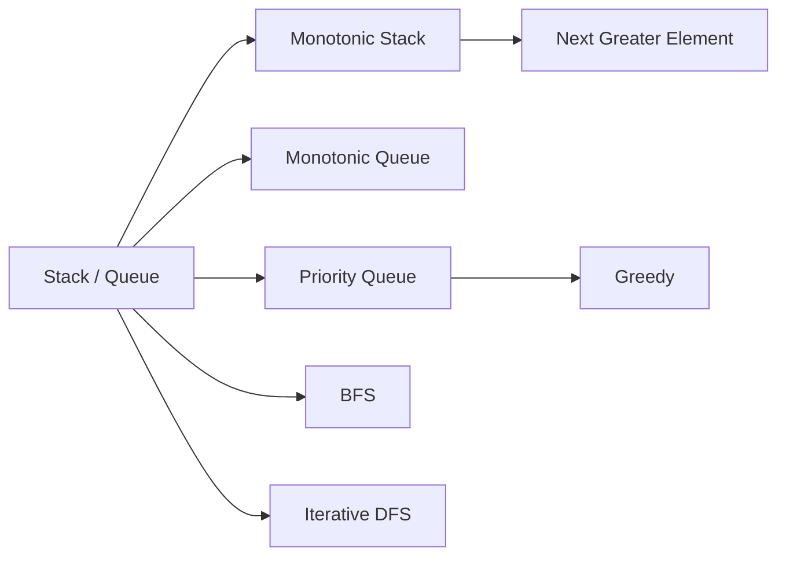
```mermaid
graph LR
  SQ[Stack / Queue] --> MonoStack[Monotonic Stack]
  SQ --> MonoQueue[Monotonic Queue]
  SQ --> PQ[Priority Queue]
  SQ --> BFS
  SQ --> DFS[Iterative DFS]
  MonoStack --> NextGreater[Next Greater Element]
  PQ --> Greedy
```
(close mermaid)

| Subcategory | Path |
|---|---|
| Classic stack problems | [数据结构/Stack&Queue/传统Stack题目](./数据结构/Stack&Queue/传统Stack题目) |
| Classic queue problems | [数据结构/Stack&Queue/传统Queue题目](./数据结构/Stack&Queue/传统Queue题目) |
| Monotonic stack | [数据结构/Stack&Queue/MonotonicStack_单调栈_题目](./数据结构/Stack&Queue/MonotonicStack_单调栈_题目) |
| Monotonic queue | [数据结构/Stack&Queue/MonotonicQueue_单调队列_题目](./数据结构/Stack&Queue/MonotonicQueue_单调队列_题目) |
| Priority queue (heap-based) | [数据结构/Stack&Queue/PriorityQueue_优先级队列_题目](./数据结构/Stack&Queue/PriorityQueue_优先级队列_题目) |
```

- [ ] **Step 2: Append Linked List section**

```markdown
### Linked List · `31 files`

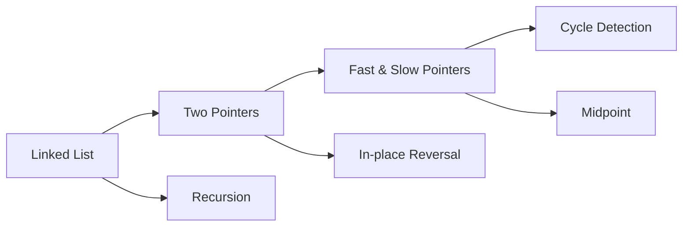
```mermaid
graph LR
  LL[Linked List] --> TP[Two Pointers]
  LL --> Recursion
  TP --> FastSlow[Fast & Slow Pointers]
  TP --> Reversal[In-place Reversal]
  FastSlow --> CycleDetect[Cycle Detection]
  FastSlow --> Midpoint
```
(close mermaid)

| Subcategory | Path |
|---|---|
| All linked list problems | [数据结构/LinkedList/List基础题](./数据结构/LinkedList/List基础题) |
| Two-pointer patterns on lists | [算法思想/2 Pointers/同向2Pointers](./算法思想/2%20Pointers/同向2Pointers) |
```

- [ ] **Step 3: Append Array / Prefix Sum section**

```markdown
### Array / Prefix Sum · `34 files`

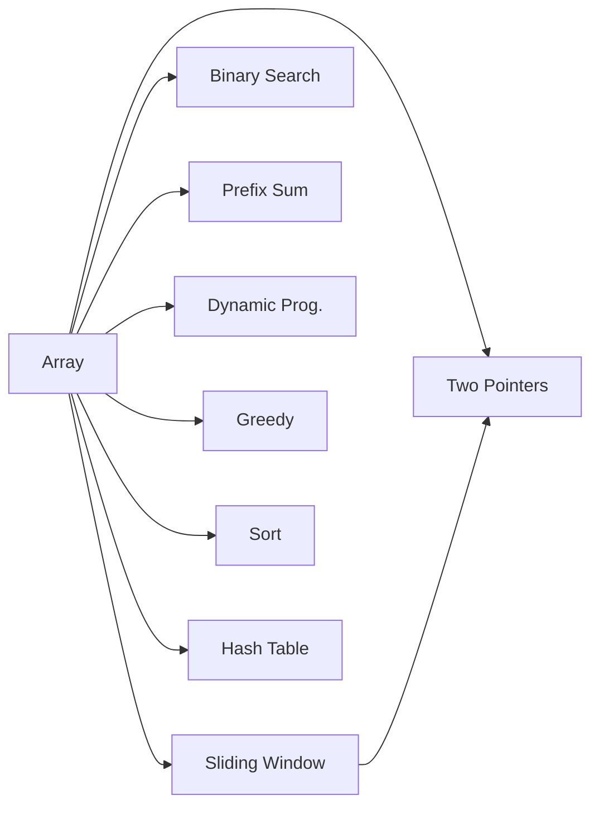
```mermaid
graph LR
  A[Array] --> TP[Two Pointers]
  A --> SW[Sliding Window]
  A --> BS[Binary Search]
  A --> PS[Prefix Sum]
  A --> DP[Dynamic Prog.]
  A --> Greedy
  A --> Sort
  A --> Hash[Hash Table]
  SW --> TP
```
(close mermaid)

| Subcategory | Path |
|---|---|
| 1D prefix sum array | [数据结构/Array - Prefix_Sum (前缀和_数组)/一维 - 前缀和数组(preSum Array)](./数据结构/Array%20-%20Prefix_Sum%20(前缀和_数组)/一维%20-%20前缀和数组(preSum%20Array)) |
| 1D prefix product array | [数据结构/Array - Prefix_Sum (前缀和_数组)/一维 - 前缀积数组(preProduce Array)](./数据结构/Array%20-%20Prefix_Sum%20(前缀和_数组)/一维%20-%20前缀积数组(preProduce%20Array)) |
| 2D prefix sum matrix | [数据结构/Array - Prefix_Sum (前缀和_数组)/二维 - 前缀和矩阵(preSum Matrix)](./数据结构/Array%20-%20Prefix_Sum%20(前缀和_数组)/二维%20-%20前缀和矩阵(preSum%20Matrix)) |
| Interval problems | [数据结构/Array基础题/区间题](./数据结构/Array基础题/区间题) |
| Circular array problems | [数据结构/Array基础题/环形数组(逻辑上的环形)](./数据结构/Array基础题/环形数组(逻辑上的环形)) |
| Sliding window | [算法思想/2 Pointers/同向2Pointers](./算法思想/2%20Pointers/同向2Pointers) |
| Binary search on arrays | [算法思想/2 Pointers/相向2Pointers](./算法思想/2%20Pointers/相向2Pointers) |
```

- [ ] **Step 4: Commit**

```bash
git add README.md
git commit -m "add Stack/Queue, Linked List, Array sections to README"
```

---

## Task 5: `README.md` — Matrix + Heap + Trie + String Sections

**Files:**
- Modify: `README.md`

- [ ] **Step 1: Append Matrix section**

```markdown
### Matrix · `38 files`

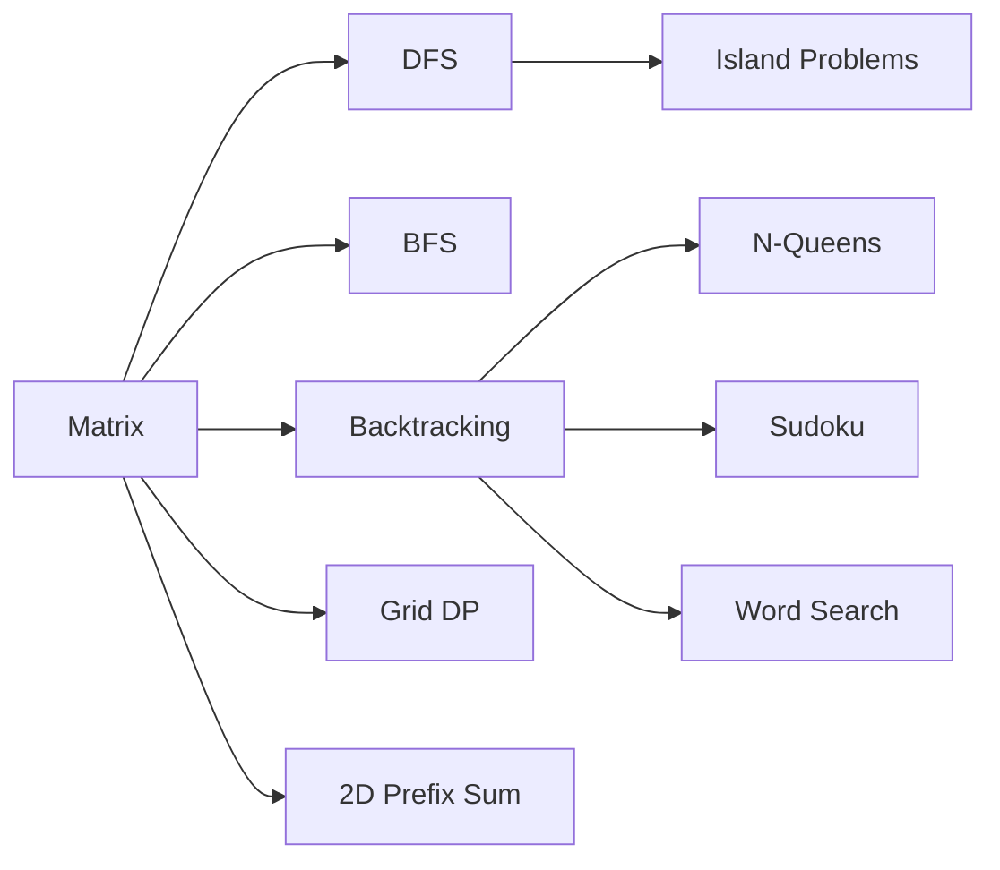
```mermaid
graph LR
  M[Matrix] --> DFS & BFS
  M --> BK[Backtracking]
  M --> DP[Grid DP]
  M --> PS[2D Prefix Sum]
  DFS --> Islands[Island Problems]
  BK --> NQ[N-Queens]
  BK --> Sudoku
  BK --> WS[Word Search]
```
(close mermaid)

| Subcategory | Path |
|---|---|
| Island problems (DFS) | [数据结构/矩阵/DFS岛屿问题](./数据结构/矩阵/DFS岛屿问题) |
| Shortest path in grid (BFS) | [数据结构/矩阵/BFS路径问题](./数据结构/矩阵/BFS路径问题) |
| N-Queens | [数据结构/矩阵/N皇后](./数据结构/矩阵/N皇后) |
| Word Search | [数据结构/矩阵/wordSearch](./数据结构/矩阵/wordSearch) |
| Sudoku solver | [数据结构/矩阵/数独](./数据结构/矩阵/数独) |
| 2D prefix sum | [数据结构/矩阵/前缀和PreSum矩阵](./数据结构/矩阵/前缀和PreSum矩阵) |
| DFS in matrix | [算法思想/DFS/DFS in 矩阵](./算法思想/DFS/DFS%20in%20矩阵) |
| BFS in matrix | [算法思想/BFS/BFS in 矩阵](./算法思想/BFS/BFS%20in%20矩阵) |
```

- [ ] **Step 2: Append Heap section**

```markdown
### Heap · `19 files`

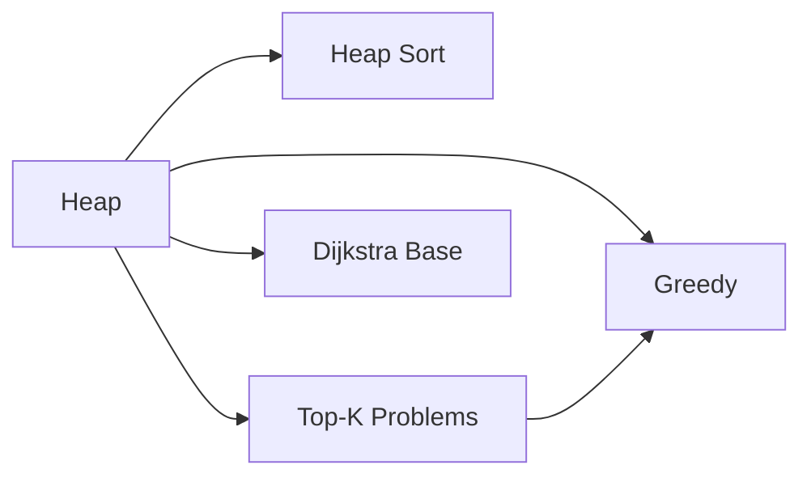
```mermaid
graph LR
  H[Heap] --> Greedy
  H --> Sort[Heap Sort]
  H --> TopK[Top-K Problems]
  H --> Dijkstra[Dijkstra Base]
  TopK --> Greedy
```
(close mermaid)

| Subcategory | Path |
|---|---|
| All heap problems | [数据结构/Heap题目](./数据结构/Heap题目) |
```

- [ ] **Step 3: Append Trie section**

```markdown
### Trie · `8 files`

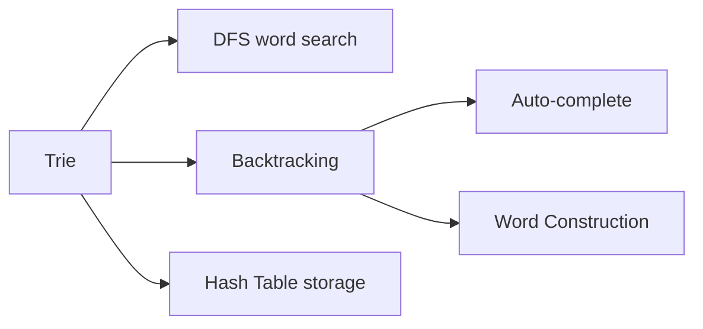
```mermaid
graph LR
  T[Trie] --> DFS[DFS word search]
  T --> BK[Backtracking]
  T --> Hash[Hash Table storage]
  BK --> AutoComplete[Auto-complete]
  BK --> WordConstruct[Word Construction]
```
(close mermaid)

| Subcategory | Path |
|---|---|
| All trie problems | [数据结构/Tire(前缀树，字典树）](./数据结构/Tire(前缀树，字典树）) |
```

- [ ] **Step 4: Append String section**

```markdown
### String · `7 files`

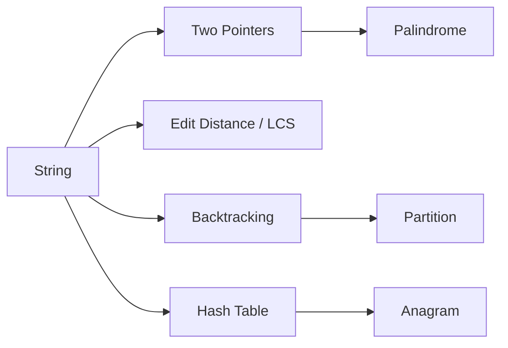
```mermaid
graph LR
  S[String] --> TP[Two Pointers]
  S --> DP[Edit Distance / LCS]
  S --> BK[Backtracking]
  S --> Hash[Hash Table]
  TP --> Palindrome
  BK --> Partition
  Hash --> Anagram
```
(close mermaid)

| Subcategory | Path |
|---|---|
| All string problems | [数据结构/String](./数据结构/String) |
| DFS in string | [算法思想/DFS/DFS in String](./算法思想/DFS/DFS%20in%20String) |
| BFS in string | [算法思想/BFS/BFS in 字符串](./算法思想/BFS/BFS%20in%20字符串) |
```

- [ ] **Step 5: Commit**

```bash
git add README.md
git commit -m "add Matrix, Heap, Trie, String sections to README"
```

---

## Task 6: `README.md` — DFS + BFS + Two Pointers Sections

**Files:**
- Modify: `README.md`

- [ ] **Step 1: Add Algorithm Techniques header and DFS section**

```markdown
---

## Algorithm Techniques

### DFS · `113 files`

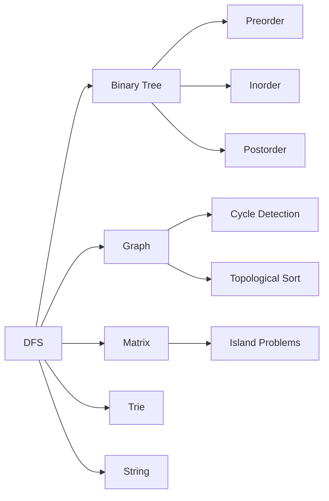
```mermaid
graph LR
  DFS --> BT[Binary Tree]
  DFS --> G[Graph]
  DFS --> Mat[Matrix]
  DFS --> Trie
  DFS --> Str[String]
  BT --> Pre[Preorder] & In[Inorder] & Post[Postorder]
  G  --> Cycle[Cycle Detection] & Topo[Topological Sort]
  Mat --> Islands[Island Problems]
```
(close mermaid)

| Subcategory | Path |
|---|---|
| DFS in binary tree | [算法思想/DFS/DFS in 二叉树 ](./算法思想/DFS/DFS%20in%20二叉树%20) |
| DFS in graph | [算法思想/DFS/DFS in 图](./算法思想/DFS/DFS%20in%20图) |
| DFS in matrix | [算法思想/DFS/DFS in 矩阵](./算法思想/DFS/DFS%20in%20矩阵) |
| DFS in n-ary tree | [算法思想/DFS/DFS in 多叉树](./算法思想/DFS/DFS%20in%20多叉树) |
| DFS in string | [算法思想/DFS/DFS in String](./算法思想/DFS/DFS%20in%20String) |
```

- [ ] **Step 2: Append BFS section**

```markdown
### BFS · `52 files`

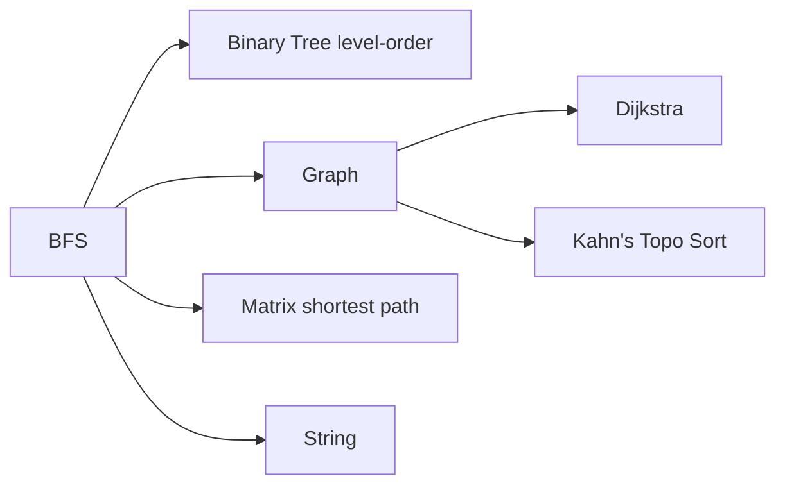
```mermaid
graph LR
  BFS --> BT[Binary Tree level-order]
  BFS --> G[Graph]
  BFS --> Mat[Matrix shortest path]
  BFS --> Str[String]
  G --> Dijk[Dijkstra]
  G --> Topo[Kahn's Topo Sort]
```
(close mermaid)

| Subcategory | Path |
|---|---|
| BFS on binary tree | [算法思想/BFS/BFS 遍历 二叉树](./算法思想/BFS/BFS%20遍历%20二叉树) |
| BFS on graph | [算法思想/BFS/BFS in 图](./算法思想/BFS/BFS%20in%20图) |
| BFS on matrix | [算法思想/BFS/BFS in 矩阵](./算法思想/BFS/BFS%20in%20矩阵) |
| BFS on string | [算法思想/BFS/BFS in 字符串](./算法思想/BFS/BFS%20in%20字符串) |
```

- [ ] **Step 3: Append Two Pointers section**

```markdown
### Two Pointers · `142 files`

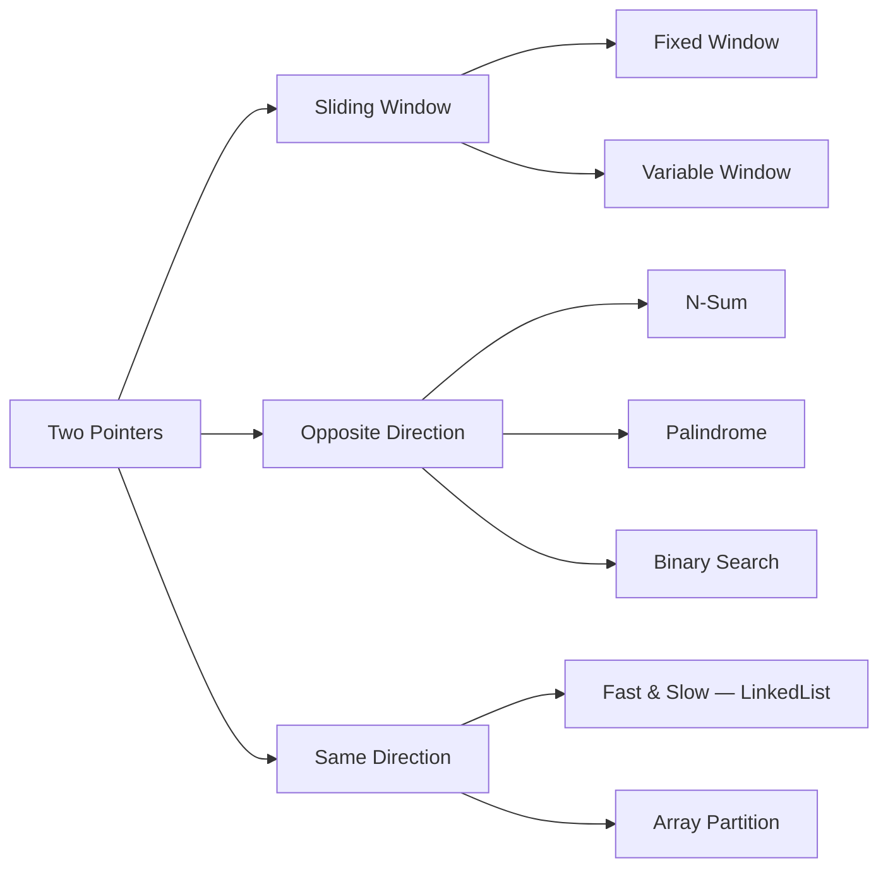
```mermaid
graph LR
  TP[Two Pointers] --> SW[Sliding Window]
  TP --> Opp[Opposite Direction]
  TP --> Same[Same Direction]
  SW --> Fixed[Fixed Window]
  SW --> Variable[Variable Window]
  Opp --> NSum[N-Sum]
  Opp --> Palindrome
  Opp --> BS[Binary Search]
  Same --> FastSlow[Fast & Slow — LinkedList]
  Same --> Partition[Array Partition]
```
(close mermaid)

| Subcategory | Path |
|---|---|
| Same-direction pointers (fast/slow, sliding window) | [算法思想/2 Pointers/同向2Pointers](./算法思想/2%20Pointers/同向2Pointers) |
| Opposite-direction pointers (binary search, N-sum) | [算法思想/2 Pointers/相向2Pointers](./算法思想/2%20Pointers/相向2Pointers) |
| Mixed / unknown pattern | [算法思想/2 Pointers/未知2Pointers](./算法思想/2%20Pointers/未知2Pointers) |
```

- [ ] **Step 4: Commit**

```bash
git add README.md
git commit -m "add DFS, BFS, Two Pointers sections to README"
```

---

## Task 7: `README.md` — DP + Backtracking + Greedy Sections

**Files:**
- Modify: `README.md`

- [ ] **Step 1: Append Dynamic Programming section**

```markdown
### Dynamic Programming · `98 files`

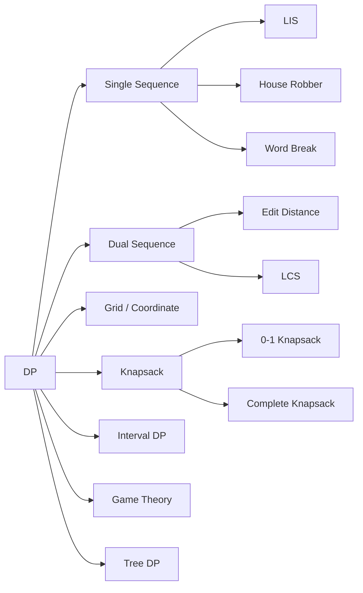
```mermaid
graph LR
  DP --> Single[Single Sequence]
  DP --> Dual[Dual Sequence]
  DP --> Grid[Grid / Coordinate]
  DP --> Knapsack[Knapsack]
  DP --> Interval[Interval DP]
  DP --> Game[Game Theory]
  DP --> Tree[Tree DP]
  Single --> LIS[LIS] & Robber[House Robber] & WB[Word Break]
  Dual --> Edit[Edit Distance] & LCS
  Knapsack --> K01[0-1 Knapsack] & KComp[Complete Knapsack]
```
(close mermaid)

| Subcategory | Path |
|---|---|
| Single-sequence DP (LIS, House Robber, Word Break…) | [算法思想/Dynamic Programming/单序列 (30%)](./算法思想/Dynamic%20Programming/单序列%20(30%25)) |
| Dual-sequence DP (Edit Distance, LCS…) | [算法思想/Dynamic Programming/双序列 (30%)](./算法思想/Dynamic%20Programming/双序列%20(30%25)) |
| Grid / coordinate DP | [算法思想/Dynamic Programming/坐标类 (15%)](./算法思想/Dynamic%20Programming/坐标类%20(15%25)) |
| Knapsack (0-1 + complete) | [算法思想/Dynamic Programming/背包问题 (10%)](./算法思想/Dynamic%20Programming/背包问题%20(10%25)) |
| Interval DP | [算法思想/Dynamic Programming/区间类 (5%)](./算法思想/Dynamic%20Programming/区间类%20(5%25)) |
| Game theory DP | [算法思想/Dynamic Programming/博弈类](./算法思想/Dynamic%20Programming/博弈类) |
| Tree DP | [算法思想/Dynamic Programming/DP in Trees](./算法思想/Dynamic%20Programming/DP%20in%20Trees) |
| Palindrome DP | [算法思想/Dynamic Programming/回文串](./算法思想/Dynamic%20Programming/回文串) |
| Stock problems | [算法思想/Dynamic Programming/股票问题](./算法思想/Dynamic%20Programming/股票问题) |
```

- [ ] **Step 2: Append Backtracking section**

```markdown
### Backtracking · `59 files`

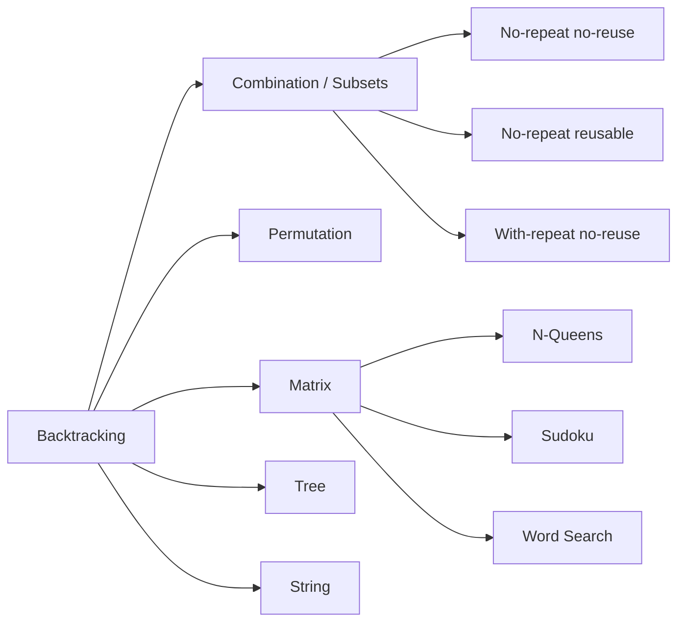
```mermaid
graph LR
  BK[Backtracking] --> Comb[Combination / Subsets]
  BK --> Perm[Permutation]
  BK --> Mat[Matrix]
  BK --> Tree
  BK --> Str[String]
  Comb --> NoRepeat[No-repeat no-reuse]
  Comb --> Reuse[No-repeat reusable]
  Comb --> Repeat[With-repeat no-reuse]
  Mat --> NQ[N-Queens] & Sudoku & WS[Word Search]
```
(close mermaid)

| Subcategory | Path |
|---|---|
| Combination & subsets | [算法思想/Backtracking](./算法思想/Backtracking) |
| Permutation variants | [算法思想/Backtracking](./算法思想/Backtracking) |
| Tree-based backtracking | [算法思想/Backtracking](./算法思想/Backtracking) |
```

- [ ] **Step 3: Append Greedy section**

```markdown
### Greedy · `25 files`

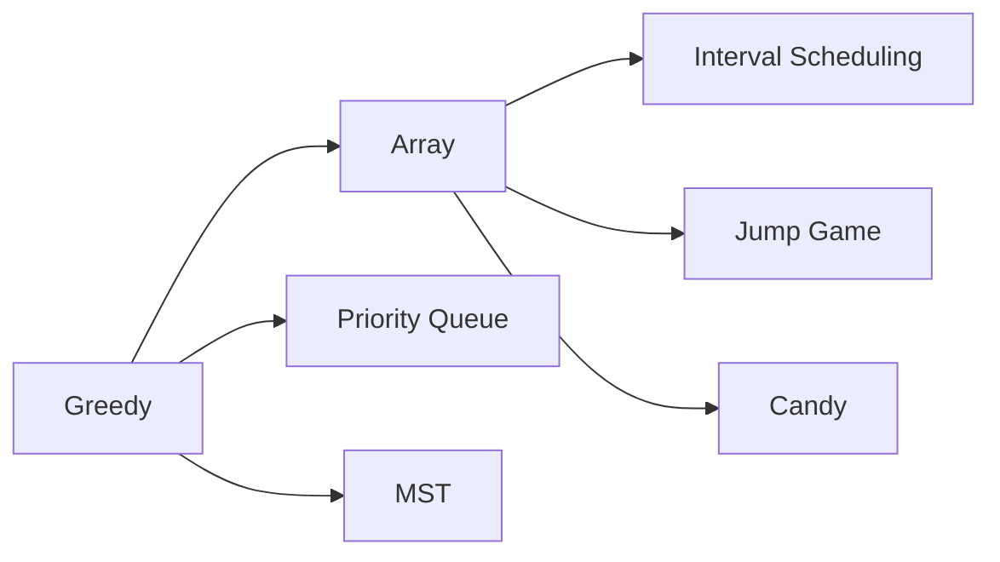
```mermaid
graph LR
  Gr[Greedy] --> Arr[Array]
  Gr --> Heap[Priority Queue]
  Gr --> Graph[MST]
  Arr --> Interval[Interval Scheduling]
  Arr --> Jump[Jump Game]
  Arr --> Candy
```
(close mermaid)

| Subcategory | Path |
|---|---|
| All greedy problems | [算法思想/Greddy Algorithm](./算法思想/Greddy%20Algorithm) |
```

- [ ] **Step 4: Commit**

```bash
git add README.md
git commit -m "add DP, Backtracking, Greedy sections to README"
```

---

## Task 8: `README.md` — Sorting + Hash Table + LeetCode Index

**Files:**
- Modify: `README.md`

- [ ] **Step 1: Append Sorting section**

```markdown
### Sorting · `20 files`

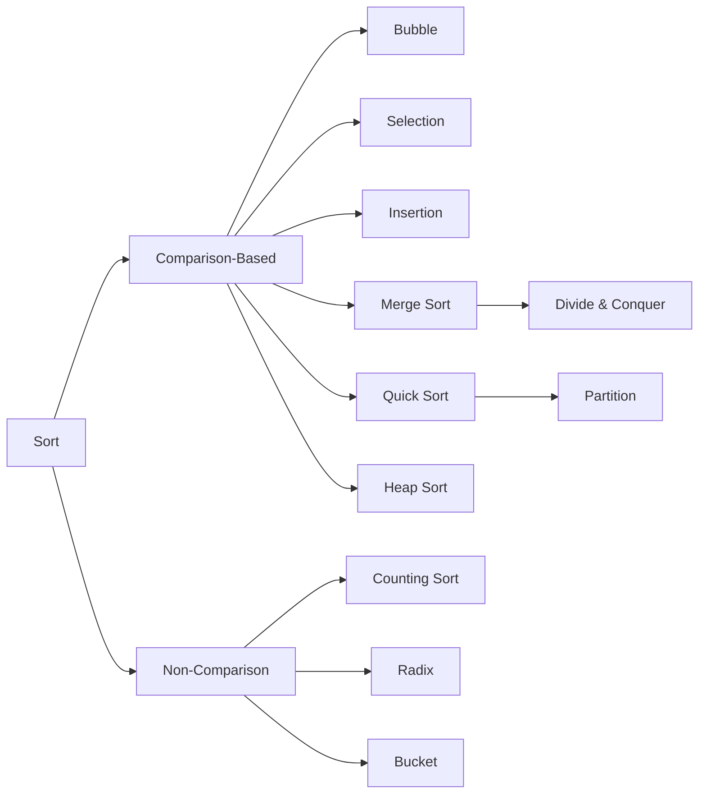
```mermaid
graph LR
  Sort --> Comparison[Comparison-Based]
  Sort --> NonComp[Non-Comparison]
  Comparison --> Bubble & Selection & Insertion
  Comparison --> Merge[Merge Sort] & Quick[Quick Sort] & HeapSort[Heap Sort]
  NonComp --> Counting[Counting Sort] & Radix & Bucket
  Merge --> DAC[Divide & Conquer]
  Quick --> Partition
```
(close mermaid)

| Subcategory | Path |
|---|---|
| All sorting implementations | [算法思想/Sort](./算法思想/Sort) |
```

- [ ] **Step 2: Append Hash Table section**

```markdown
### Hash Table · `31 files`

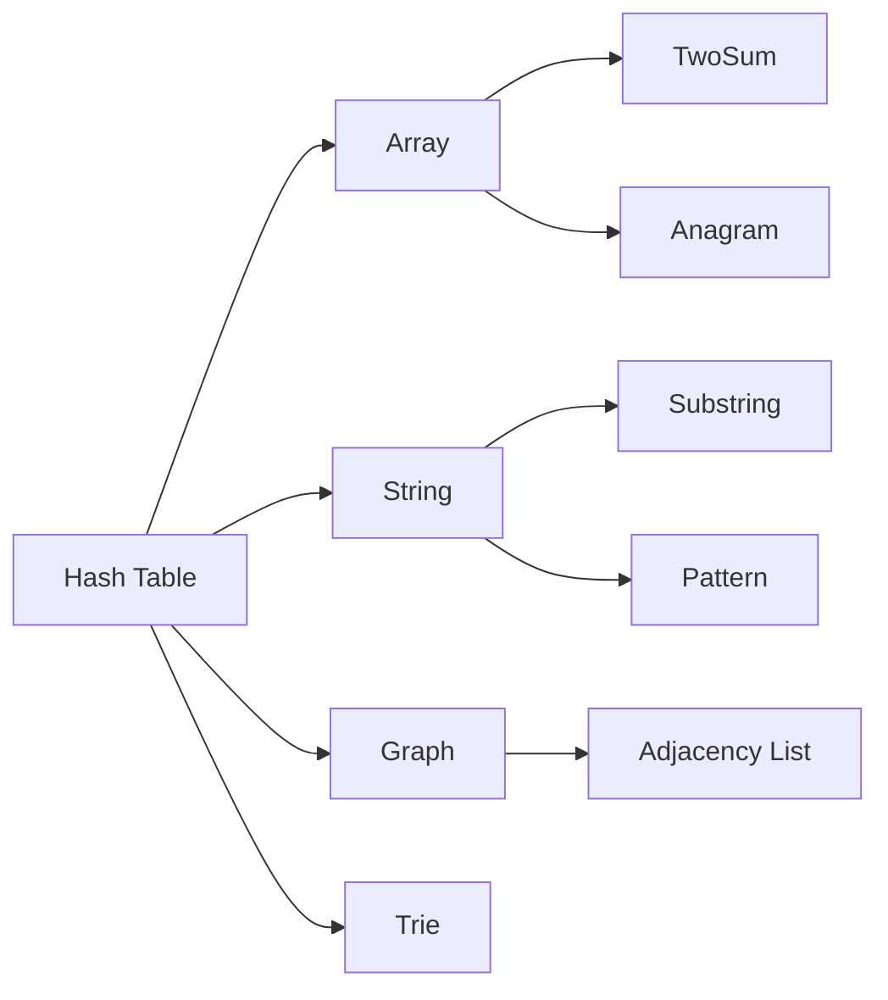
```mermaid
graph LR
  Hash[Hash Table] --> Array
  Hash --> String
  Hash --> Graph
  Hash --> Trie
  Array --> TwoSum & Anagram
  String --> Substring & Pattern
  Graph --> AdjList[Adjacency List]
```
(close mermaid)

| Subcategory | Path |
|---|---|
| All hash table technique problems | [算法思想/Hashtable 技巧](./算法思想/Hashtable%20技巧) |
```

- [ ] **Step 3: Append LeetCode Index section**

```markdown
---

## LeetCode Index

Problems organized by number (1 → 2951+). Each file is named `<problem-name>.lc<number>.js` or just `<number>.js`.

| Folder | Contents |
|---|---|
| [Leetcode/](./Leetcode) | 523 problems, numbered 1–2951+ |

> **Tip:** Use your editor's file search (`Cmd+P` / `Ctrl+P`) and type a problem number to jump directly to its solution.
```

- [ ] **Step 4: Commit**

```bash
git add README.md
git commit -m "add Sorting, Hash Table, LeetCode Index sections to README"
```

---

## Task 9: Update `.gitignore`

**Files:**
- Modify: `.gitignore` (create if absent)

- [ ] **Step 1: Check if .gitignore exists**

```bash
ls /Users/mingyueliu/Documents/GitHub/DataStructure-Algo/.gitignore
```

- [ ] **Step 2: Add `.superpowers/` entry**

If `.gitignore` exists, append:
```
.superpowers/
```

If it does not exist, create it with:
```
.superpowers/
.DS_Store
```

- [ ] **Step 3: Commit**

```bash
git add .gitignore
git commit -m "add .gitignore with .superpowers/ exclusion"
```

---

## Self-Review Checklist

- [x] **graph.html** — full D3 code included, no placeholders
- [x] **README header + overview Mermaid** — full content in Task 2
- [x] **All 9 DS sections** — Binary Tree, Graph, Stack/Queue, LinkedList, Array, Matrix, Heap, Trie, String (Tasks 3–5)
- [x] **All 8 Algorithm sections** — DFS, BFS, TwoPointers, DP, Backtracking, Greedy, Sorting, HashTable (Tasks 6–8)
- [x] **LeetCode section** — Task 8 Step 3
- [x] **.gitignore** — Task 9
- [x] **No TBD/TODO placeholders** — all folder paths are exact real paths verified from `ls` output
- [x] **Type consistency** — node IDs in graph.html match spec (BinaryTree, Graph, Array, etc.)
- [x] **Folder paths** — verified against actual repo: `数据结构/矩阵/` (not `矩阵 (Matrix)/`), `数据结构/Tire(前缀树，字典树）/` (typo preserved), `算法思想/Greddy Algorithm/` (typo preserved)
