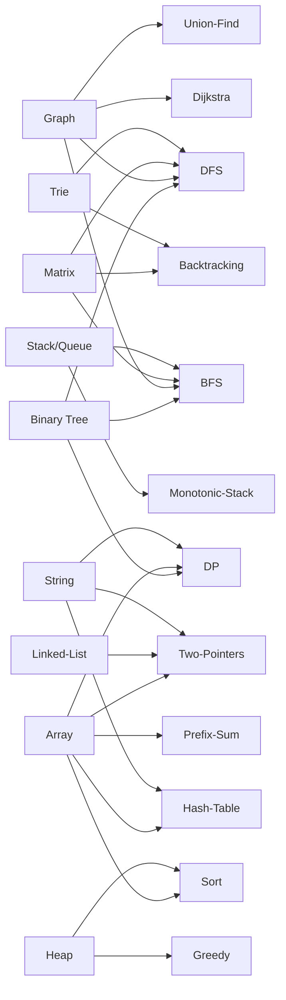
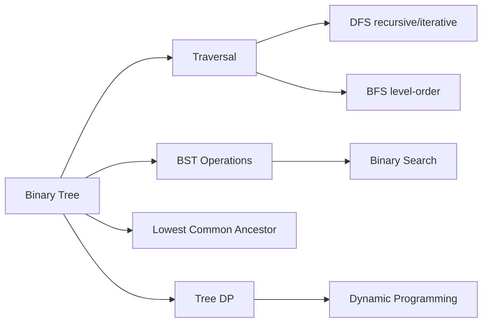
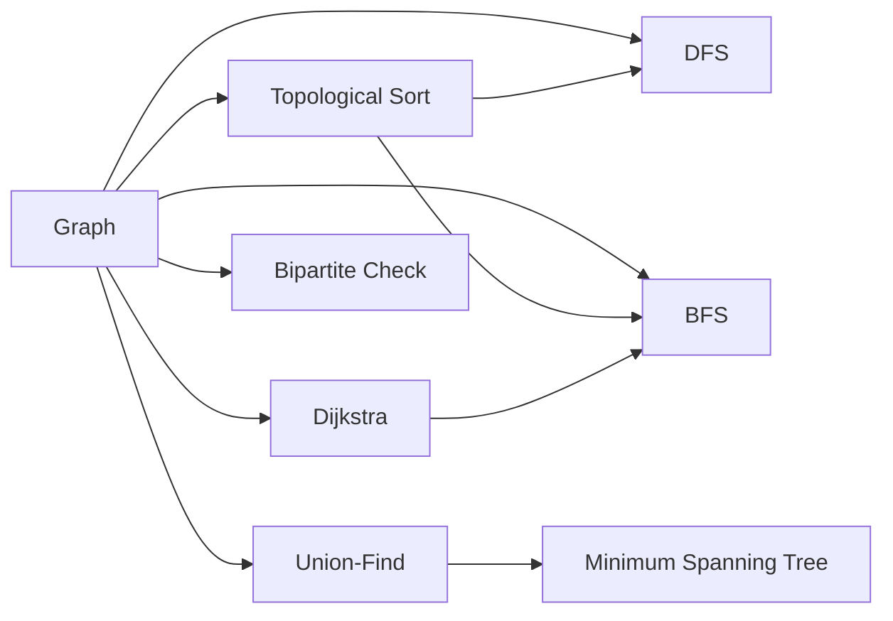
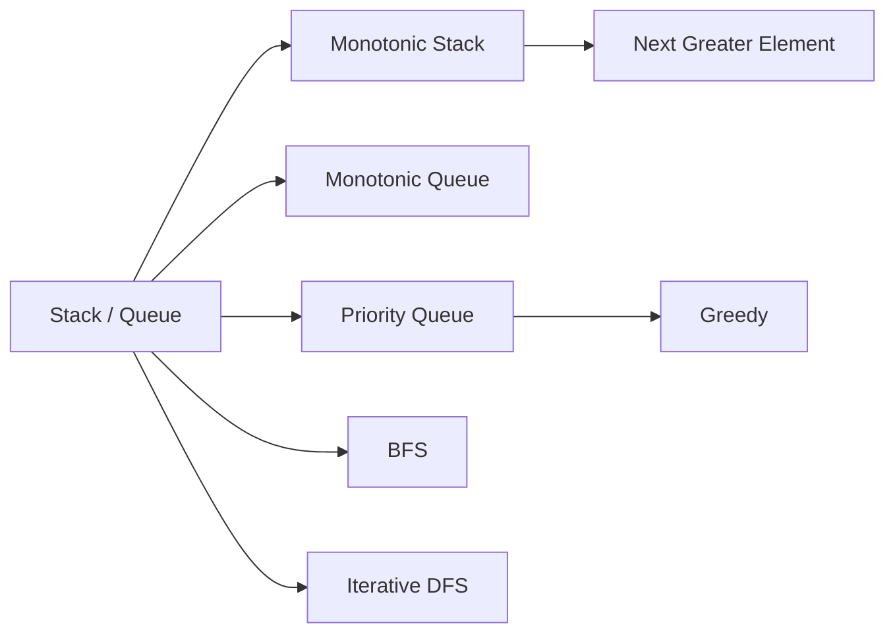
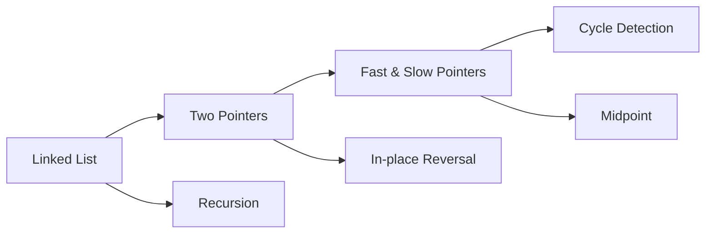
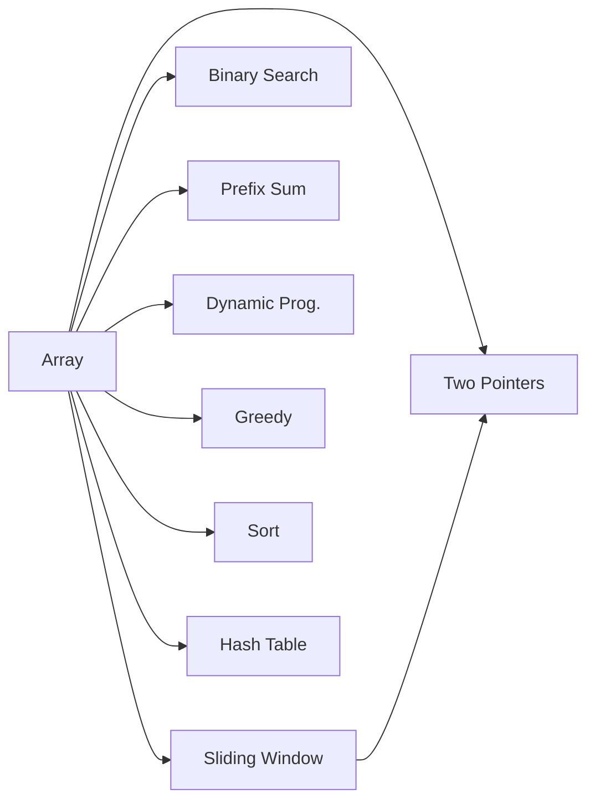

# DataStructure-Algo

1,500+ LeetCode solutions in JavaScript, organized by data structure and algorithm technique.

> **[→ Open Interactive Knowledge Graph](./graph.html)** — drag nodes, hover to highlight connections

---

## Overview

How data structures and algorithm techniques connect across this repo:

---

## Quick Navigation

**Data Structures**
[Binary Tree](#binary-tree--94-files) · [Graph](#graph--43-files) · [Stack & Queue](#stack--queue--61-files) · [Linked List](#linked-list--31-files) · [Array / Prefix Sum](#array--prefix-sum--34-files) · [Matrix](#matrix--38-files) · [Heap](#heap--19-files) · [Trie](#trie--8-files) · [String](#string--7-files)

**Algorithm Techniques**
[DFS](#dfs--113-files) · [BFS](#bfs--52-files) · [Two Pointers](#two-pointers--142-files) · [Dynamic Programming](#dynamic-programming--98-files) · [Backtracking](#backtracking--59-files) · [Greedy](#greedy--25-files) · [Sorting](#sorting--20-files) · [Hash Table](#hash-table--31-files)

**[LeetCode Index](#leetcode-index)**

---

## Data Structures

### Binary Tree · `94 files`

| Subcategory | Path |
|---|---|
| Traversal templates (recursive + iterative) | [数据结构/BinaryTree二叉树/遍历模版](./数据结构/BinaryTree二叉树/遍历模版) |
| Tree properties & queries | [数据结构/BinaryTree二叉树/二叉树的属性](./数据结构/BinaryTree二叉树/二叉树的属性) |
| Tree construction & modification | [数据结构/BinaryTree二叉树/二叉树的修改和构造](./数据结构/BinaryTree二叉树/二叉树的修改和构造) |
| BST — properties & validation | [数据结构/BinaryTree二叉树/BST(二叉搜索树)的属性](./数据结构/BinaryTree二叉树/BST(二叉搜索树)的属性) |
| BST — insertion, deletion, construction | [数据结构/BinaryTree二叉树/BST(二叉搜索树)的修改和构造](./数据结构/BinaryTree二叉树/BST(二叉搜索树)的修改和构造) |
| Lowest Common Ancestor (LCA) | [数据结构/BinaryTree二叉树/二叉树最近公共祖先问题(LCA)](./数据结构/BinaryTree二叉树/二叉树最近公共祖先问题\(LCA\)) |
| DFS problems | [算法思想/DFS/DFS in 二叉树 ](./算法思想/DFS/DFS%20in%20二叉树%20) |
| BFS problems | [算法思想/BFS/BFS 遍历 二叉树](./算法思想/BFS/BFS%20遍历%20二叉树) |

### Graph · `43 files`

| Subcategory | Path |
|---|---|
| BFS traversal | [数据结构/Graph/BFS遍历](./数据结构/Graph/BFS遍历) |
| DFS traversal | [数据结构/Graph/DFS遍历](./数据结构/Graph/DFS遍历) |
| Union-Find (Disjoint Set) | [数据结构/Graph/并查集(Union Find)](./数据结构/Graph/并查集(Union%20Find)) |
| Shortest / longest path (Dijkstra, BFS) | [数据结构/Graph/最短(长)路径](./数据结构/Graph/最短(长)路径) |
| Cycle detection + topological sort | [数据结构/Graph/环检测_topologicalSort](./数据结构/Graph/环检测_topologicalSort) |
| Bipartite graph | [数据结构/Graph/二分图](./数据结构/Graph/二分图) |
| Kruskal MST | [数据结构/Graph/Kruskal最小生成树算法](./数据结构/Graph/Kruskal最小生成树算法) |
| DFS in graph | [算法思想/DFS/DFS in 图](./算法思想/DFS/DFS%20in%20图) |
| BFS in graph | [算法思想/BFS/BFS in 图](./算法思想/BFS/BFS%20in%20图) |

### Stack & Queue · `61 files`

| Subcategory | Path |
|---|---|
| Classic stack problems | [数据结构/Stack&Queue/传统Stack题目](./数据结构/Stack&Queue/传统Stack题目) |
| Classic queue problems | [数据结构/Stack&Queue/传统Queue题目](./数据结构/Stack&Queue/传统Queue题目) |
| Monotonic stack | [数据结构/Stack&Queue/MonotonicStack_单调栈_题目](./数据结构/Stack&Queue/MonotonicStack_单调栈_题目) |
| Monotonic queue | [数据结构/Stack&Queue/MonotonicQueue_单调队列_题目](./数据结构/Stack&Queue/MonotonicQueue_单调队列_题目) |
| Priority queue (heap-based) | [数据结构/Stack&Queue/PriorityQueue_优先级队列_题目](./数据结构/Stack&Queue/PriorityQueue_优先级队列_题目) |

### Linked List · `31 files`

| Subcategory | Path |
|---|---|
| All linked list problems | [数据结构/LinkedList/List基础题](./数据结构/LinkedList/List基础题) |
| Two-pointer patterns on lists | [算法思想/2 Pointers/同向2Pointers](./算法思想/2%20Pointers/同向2Pointers) |

### Array / Prefix Sum · `34 files`

| Subcategory | Path |
|---|---|
| 1D prefix sum array | [数据结构/Array - Prefix_Sum (前缀和_数组)/一维 - 前缀和数组(preSum Array)](./数据结构/Array%20-%20Prefix_Sum%20(前缀和_数组)/一维%20-%20前缀和数组(preSum%20Array)) |
| 1D prefix product array | [数据结构/Array - Prefix_Sum (前缀和_数组)/一维 - 前缀积数组(preProduce Array)](./数据结构/Array%20-%20Prefix_Sum%20(前缀和_数组)/一维%20-%20前缀积数组(preProduce%20Array)) |
| 2D prefix sum matrix | [数据结构/Array - Prefix_Sum (前缀和_数组)/二维 - 前缀和矩阵(preSum Matrix)](./数据结构/Array%20-%20Prefix_Sum%20(前缀和_数组)/二维%20-%20前缀和矩阵(preSum%20Matrix)) |
| Interval problems | [数据结构/Array基础题/区间题](./数据结构/Array基础题/区间题) |
| Circular array problems | [数据结构/Array基础题/环形数组(逻辑上的环形)](./数据结构/Array基础题/环形数组(逻辑上的环形)) |
| Sliding window | [算法思想/2 Pointers/同向2Pointers](./算法思想/2%20Pointers/同向2Pointers) |
| Binary search on arrays | [算法思想/2 Pointers/相向2Pointers](./算法思想/2%20Pointers/相向2Pointers) |
