# DataStructure-Algo

> 1,500+ LeetCode solutions in JavaScript, organized by data structure and algorithm technique.

**[→ Open Interactive Knowledge Graph](https://986913.github.io/DataStructure-Algo/graph.html)** — drag nodes, hover to highlight connections

---

## Data Structures

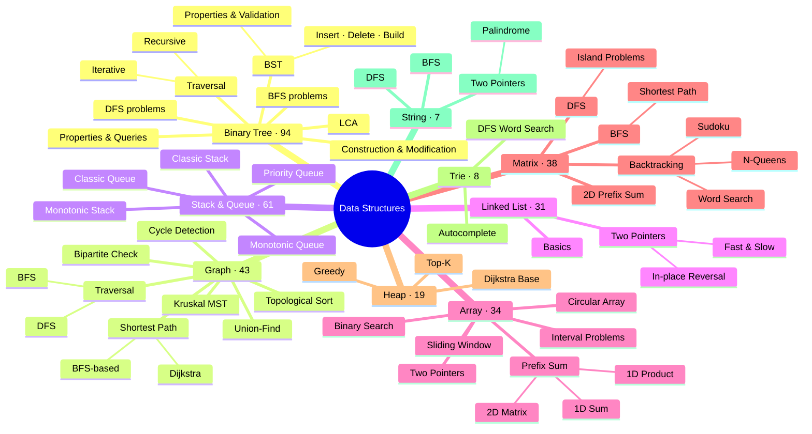
```mermaid
mindmap
  root((Data Structures))
    Binary Tree · 94
      Traversal
        Recursive
        Iterative
      Properties & Queries
      Construction & Modification
      BST
        Properties & Validation
        Insert · Delete · Build
      LCA
      DFS problems
      BFS problems
    Graph · 43
      Traversal
        BFS
        DFS
      Union-Find
      Shortest Path
        Dijkstra
        BFS-based
      Cycle Detection
      Topological Sort
      Bipartite Check
      Kruskal MST
    Stack & Queue · 61
      Classic Stack
      Classic Queue
      Monotonic Stack
      Monotonic Queue
      Priority Queue
    Linked List · 31
      Basics
      Two Pointers
        Fast & Slow
        In-place Reversal
    Array · 34
      Prefix Sum
        1D Sum
        1D Product
        2D Matrix
      Interval Problems
      Circular Array
      Sliding Window
      Binary Search
      Two Pointers
    Matrix · 38
      DFS
        Island Problems
      BFS
        Shortest Path
      Backtracking
        N-Queens
        Word Search
        Sudoku
      2D Prefix Sum
    Heap · 19
      Top-K
      Dijkstra Base
      Greedy
    Trie · 8
      DFS Word Search
      Autocomplete
    String · 7
      Two Pointers
        Palindrome
      DFS
      BFS
```

---

## Algorithm Techniques

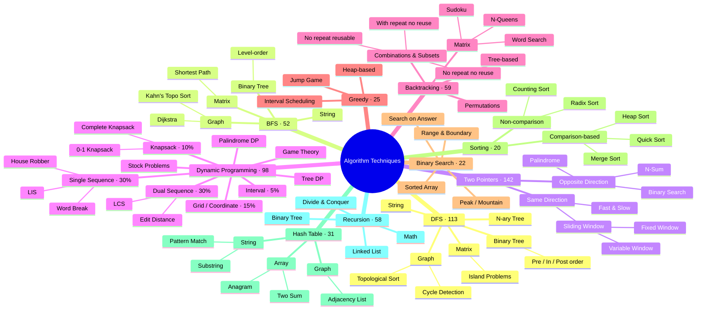
```mermaid
mindmap
  root((Algorithm Techniques))
    DFS · 113
      Binary Tree
        Pre / In / Post order
      Graph
        Cycle Detection
        Topological Sort
      Matrix
        Island Problems
      N-ary Tree
      String
    BFS · 52
      Binary Tree
        Level-order
      Graph
        Dijkstra
        Kahn's Topo Sort
      Matrix
        Shortest Path
      String
    Two Pointers · 142
      Same Direction
        Fast & Slow
        Sliding Window
          Fixed Window
          Variable Window
      Opposite Direction
        N-Sum
        Palindrome
        Binary Search
    Dynamic Programming · 98
      Single Sequence · 30%
        LIS
        House Robber
        Word Break
      Dual Sequence · 30%
        Edit Distance
        LCS
      Grid / Coordinate · 15%
      Knapsack · 10%
        0-1 Knapsack
        Complete Knapsack
      Interval · 5%
      Tree DP
      Palindrome DP
      Stock Problems
      Game Theory
    Backtracking · 59
      Combinations & Subsets
        No repeat no reuse
        No repeat reusable
        With repeat no reuse
      Permutations
      Matrix
        N-Queens
        Sudoku
        Word Search
      Tree-based
    Greedy · 25
      Interval Scheduling
      Jump Game
      Heap-based
    Binary Search · 22
      Sorted Array
      Range & Boundary
      Peak / Mountain
      Search on Answer
    Sorting · 20
      Comparison-based
        Merge Sort
        Quick Sort
        Heap Sort
      Non-comparison
        Counting Sort
        Radix Sort
    Hash Table · 31
      Array
        Two Sum
        Anagram
      String
        Substring
        Pattern Match
      Graph
        Adjacency List
    Recursion · 58
      Binary Tree
      Linked List
      Divide & Conquer
      Math
```

---

## Detailed Paths

### Binary Tree

| Subcategory                                 | Path                                                                         |
| ------------------------------------------- | ---------------------------------------------------------------------------- |
| Traversal templates (recursive + iterative) | [遍历模版](./数据结构/BinaryTree二叉树/遍历模版)                             |
| Tree properties & queries                   | [二叉树的属性](./数据结构/BinaryTree二叉树/二叉树的属性)                     |
| Tree construction & modification            | [二叉树的修改和构造](./数据结构/BinaryTree二叉树/二叉树的修改和构造)         |
| BST — properties & validation               | [BST的属性](<./数据结构/BinaryTree二叉树/BST(二叉搜索树)的属性>)             |
| BST — insertion, deletion, construction     | [BST的修改和构造](<./数据结构/BinaryTree二叉树/BST(二叉搜索树)的修改和构造>) |
| Lowest Common Ancestor (LCA)                | [LCA问题](<./数据结构/BinaryTree二叉树/二叉树最近公共祖先问题(LCA)>)         |
| DFS problems                                | [DFS in 二叉树](./算法思想/DFS/DFS%20in%20二叉树%20)                         |
| BFS problems                                | [BFS 遍历 二叉树](./算法思想/BFS/BFS%20遍历%20二叉树)                        |

### Graph

| Subcategory                             | Path                                                               |
| --------------------------------------- | ------------------------------------------------------------------ |
| BFS traversal                           | [BFS遍历](./数据结构/Graph/BFS遍历)                                |
| DFS traversal                           | [DFS遍历](./数据结构/Graph/DFS遍历)                                |
| Union-Find (Disjoint Set)               | [并查集](<./数据结构/Graph/并查集(Union%20Find)>)                  |
| Shortest / longest path (Dijkstra, BFS) | [最短(长)路径](<./数据结构/Graph/最短(长)路径>)                    |
| Cycle detection + topological sort      | [环检测\_topologicalSort](./数据结构/Graph/环检测_topologicalSort) |
| Bipartite graph                         | [二分图](./数据结构/Graph/二分图)                                  |
| Kruskal MST                             | [Kruskal最小生成树](./数据结构/Graph/Kruskal最小生成树算法)        |
| DFS in graph                            | [DFS in 图](./算法思想/DFS/DFS%20in%20图)                          |
| BFS in graph                            | [BFS in 图](./算法思想/BFS/BFS%20in%20图)                          |

### Stack & Queue

| Subcategory                 | Path                                                               |
| --------------------------- | ------------------------------------------------------------------ |
| Classic stack problems      | [传统Stack题目](./数据结构/Stack&Queue/传统Stack题目)              |
| Classic queue problems      | [传统Queue题目](./数据结构/Stack&Queue/传统Queue题目)              |
| Monotonic stack             | [单调栈](./数据结构/Stack&Queue/MonotonicStack_单调栈_题目)        |
| Monotonic queue             | [单调队列](./数据结构/Stack&Queue/MonotonicQueue_单调队列_题目)    |
| Priority queue (heap-based) | [优先级队列](./数据结构/Stack&Queue/PriorityQueue_优先级队列_题目) |

### Linked List

| Subcategory                   | Path                                                   |
| ----------------------------- | ------------------------------------------------------ |
| All linked list problems      | [List基础题](./数据结构/LinkedList/List基础题)         |
| Two-pointer patterns on lists | [同向2Pointers](./算法思想/2%20Pointers/同向2Pointers) |

### Array / Prefix Sum

| Subcategory                               | Path                                                                                                            |
| ----------------------------------------- | --------------------------------------------------------------------------------------------------------------- |
| 1D prefix sum                             | [一维前缀和数组](<./数据结构/Array%20-%20Prefix_Sum%20(前缀和_数组)/一维%20-%20前缀和数组(preSum%20Array)>)     |
| 1D prefix product                         | [一维前缀积数组](<./数据结构/Array%20-%20Prefix_Sum%20(前缀和_数组)/一维%20-%20前缀积数组(preProduce%20Array)>) |
| 2D prefix sum matrix                      | [二维前缀和矩阵](<./数据结构/Array%20-%20Prefix_Sum%20(前缀和_数组)/二维%20-%20前缀和矩阵(preSum%20Matrix)>)    |
| Interval problems                         | [区间题](./数据结构/Array基础题/区间题)                                                                         |
| Circular array                            | [环形数组](<./数据结构/Array基础题/环形数组(逻辑上的环形)>)                                                     |
| Sliding window                            | [同向2Pointers](./算法思想/2%20Pointers/同向2Pointers)                                                          |
| Binary search                             | [Binary Search](./算法思想/Searching/Binary%20Search)                                                           |
| Opposite two pointers (N-sum, palindrome) | [相向2Pointers](./算法思想/2%20Pointers/相向2Pointers)                                                          |

### Matrix

| Subcategory                 | Path                                                 |
| --------------------------- | ---------------------------------------------------- |
| Island problems (DFS)       | [DFS岛屿问题](./数据结构/矩阵/DFS岛屿问题)           |
| Shortest path in grid (BFS) | [BFS路径问题](./数据结构/矩阵/BFS路径问题)           |
| N-Queens                    | [N皇后](./数据结构/矩阵/N皇后)                       |
| Word Search                 | [wordSearch](./数据结构/矩阵/wordSearch)             |
| Sudoku solver               | [数独](./数据结构/矩阵/数独)                         |
| 2D prefix sum               | [前缀和PreSum矩阵](./数据结构/矩阵/前缀和PreSum矩阵) |
| DFS in matrix               | [DFS in 矩阵](./算法思想/DFS/DFS%20in%20矩阵)        |
| BFS in matrix               | [BFS in 矩阵](./算法思想/BFS/BFS%20in%20矩阵)        |

### Heap

| Subcategory       | Path                            |
| ----------------- | ------------------------------- |
| All heap problems | [Heap题目](./数据结构/Heap题目) |

### Trie

| Subcategory       | Path                                           |
| ----------------- | ---------------------------------------------- |
| All trie problems | [Trie前缀树](./数据结构/Tire(前缀树，字典树）) |

### String

| Subcategory         | Path                                              |
| ------------------- | ------------------------------------------------- |
| All string problems | [String](./数据结构/String)                       |
| DFS in string       | [DFS in String](./算法思想/DFS/DFS%20in%20String) |
| BFS in string       | [BFS in 字符串](./算法思想/BFS/BFS%20in%20字符串) |

---

### DFS

| Subcategory        | Path                                                 |
| ------------------ | ---------------------------------------------------- |
| DFS in binary tree | [DFS in 二叉树](./算法思想/DFS/DFS%20in%20二叉树%20) |
| DFS in graph       | [DFS in 图](./算法思想/DFS/DFS%20in%20图)            |
| DFS in matrix      | [DFS in 矩阵](./算法思想/DFS/DFS%20in%20矩阵)        |
| DFS in n-ary tree  | [DFS in 多叉树](./算法思想/DFS/DFS%20in%20多叉树)    |
| DFS in string      | [DFS in String](./算法思想/DFS/DFS%20in%20String)    |

### BFS

| Subcategory        | Path                                                  |
| ------------------ | ----------------------------------------------------- |
| BFS on binary tree | [BFS 遍历 二叉树](./算法思想/BFS/BFS%20遍历%20二叉树) |
| BFS on graph       | [BFS in 图](./算法思想/BFS/BFS%20in%20图)             |
| BFS on matrix      | [BFS in 矩阵](./算法思想/BFS/BFS%20in%20矩阵)         |
| BFS on string      | [BFS in 字符串](./算法思想/BFS/BFS%20in%20字符串)     |

### Two Pointers

| Subcategory                                | Path                                                   |
| ------------------------------------------ | ------------------------------------------------------ |
| Same-direction (fast/slow, sliding window) | [同向2Pointers](./算法思想/2%20Pointers/同向2Pointers) |
| Opposite-direction (binary search, N-sum)  | [相向2Pointers](./算法思想/2%20Pointers/相向2Pointers) |
| Mixed / unknown pattern                    | [未知2Pointers](./算法思想/2%20Pointers/未知2Pointers) |

### Dynamic Programming

| Subcategory                                         | Path                                                                    |
| --------------------------------------------------- | ----------------------------------------------------------------------- |
| Single-sequence DP (LIS, House Robber, Word Break…) | [单序列 (30%)](<./算法思想/Dynamic%20Programming/单序列%20(30%25)>)     |
| Dual-sequence DP (Edit Distance, LCS…)              | [双序列 (30%)](<./算法思想/Dynamic%20Programming/双序列%20(30%25)>)     |
| Grid / coordinate DP                                | [坐标类 (15%)](<./算法思想/Dynamic%20Programming/坐标类%20(15%25)>)     |
| Knapsack (0-1 + complete)                           | [背包问题 (10%)](<./算法思想/Dynamic%20Programming/背包问题%20(10%25)>) |
| Interval DP                                         | [区间类 (5%)](<./算法思想/Dynamic%20Programming/区间类%20(5%25)>)       |
| Game theory DP                                      | [博弈类](./算法思想/Dynamic%20Programming/博弈类)                       |
| Tree DP                                             | [DP in Trees](./算法思想/Dynamic%20Programming/DP%20in%20Trees)         |
| Palindrome DP                                       | [回文串](./算法思想/Dynamic%20Programming/回文串)                       |
| Stock problems                                      | [股票问题](./算法思想/Dynamic%20Programming/股票问题)                   |

### Backtracking

| Subcategory                                     | Path                                    |
| ----------------------------------------------- | --------------------------------------- |
| Combinations, subsets & permutations            | [Backtracking](./算法思想/Backtracking) |
| Matrix problems (N-Queens, Sudoku, Word Search) | [Backtracking](./算法思想/Backtracking) |
| Tree-based backtracking                         | [Backtracking](./算法思想/Backtracking) |

### Greedy

| Subcategory         | Path                                              |
| ------------------- | ------------------------------------------------- |
| All greedy problems | [Greedy Algorithm](./算法思想/Greddy%20Algorithm) |

### Binary Search

| Subcategory                         | Path                                                   |
| ----------------------------------- | ------------------------------------------------------ |
| All binary search problems          | [Binary Search](./算法思想/Searching/Binary%20Search)  |
| Opposite-direction pointer patterns | [相向2Pointers](./算法思想/2%20Pointers/相向2Pointers) |

### Sorting

| Subcategory                 | Path                    |
| --------------------------- | ----------------------- |
| All sorting implementations | [Sort](./算法思想/Sort) |

### Hash Table

| Subcategory             | Path                                          |
| ----------------------- | --------------------------------------------- |
| All hash table problems | [Hashtable 技巧](./算法思想/Hashtable%20技巧) |

### Recursion

| Subcategory            | Path                              |
| ---------------------- | --------------------------------- |
| All recursion problems | [Recursion](./算法思想/Recursion) |

---

## LeetCode Index

523 problems numbered 1–2951+, located in [`Leetcode/`](./Leetcode).

Each file is named `<problem-name>.lc<number>.js` — use `Cmd+P` / `Ctrl+P` in your editor and type a problem number to jump directly to its solution.

1,500+ LeetCode solutions in JavaScript, organized by data structure and algorithm technique.

> **[→ Open Interactive Knowledge Graph](https://986913.github.io/DataStructure-Algo/graph.html)** — drag nodes, hover to highlight connections

---

## Quick Navigation

**Data Structures**
[Binary Tree](#binary-tree) · [Graph](#graph) · [Stack & Queue](#stack--queue) · [Linked List](#linked-list) · [Array / Prefix Sum](#array--prefix-sum) · [Matrix](#matrix) · [Heap](#heap) · [Trie](#trie) · [String](#string)

**Algorithm Techniques**
[DFS](#dfs) · [BFS](#bfs) · [Two Pointers](#two-pointers) · [Dynamic Programming](#dynamic-programming) · [Backtracking](#backtracking) · [Greedy](#greedy) · [Sorting](#sorting) · [Hash Table](#hash-table)

**[LeetCode Index](#leetcode-index)**

---

## Data Structures

### Binary Tree

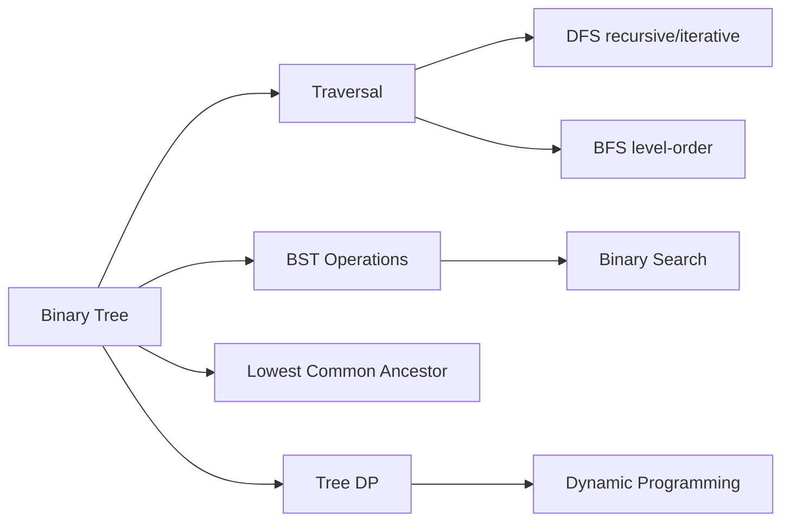
```mermaid
graph LR
  BT[Binary Tree] --> Traversal
  BT --> BST[BST Operations]
  BT --> LCA[Lowest Common Ancestor]
  BT --> TreeDP[Tree DP]
  Traversal --> DFS[DFS recursive/iterative]
  Traversal --> BFS[BFS level-order]
  BST --> BinarySearch[Binary Search]
  TreeDP --> DP[Dynamic Programming]
```

| Subcategory                                 | Path                                                                                                               |
| ------------------------------------------- | ------------------------------------------------------------------------------------------------------------------ |
| Traversal templates (recursive + iterative) | [数据结构/BinaryTree二叉树/遍历模版](./数据结构/BinaryTree二叉树/遍历模版)                                         |
| Tree properties & queries                   | [数据结构/BinaryTree二叉树/二叉树的属性](./数据结构/BinaryTree二叉树/二叉树的属性)                                 |
| Tree construction & modification            | [数据结构/BinaryTree二叉树/二叉树的修改和构造](./数据结构/BinaryTree二叉树/二叉树的修改和构造)                     |
| BST — properties & validation               | [数据结构/BinaryTree二叉树/BST(二叉搜索树)的属性](<./数据结构/BinaryTree二叉树/BST(二叉搜索树)的属性>)             |
| BST — insertion, deletion, construction     | [数据结构/BinaryTree二叉树/BST(二叉搜索树)的修改和构造](<./数据结构/BinaryTree二叉树/BST(二叉搜索树)的修改和构造>) |
| Lowest Common Ancestor (LCA)                | [数据结构/BinaryTree二叉树/二叉树最近公共祖先问题(LCA)](<./数据结构/BinaryTree二叉树/二叉树最近公共祖先问题(LCA)>) |
| DFS problems                                | [算法思想/DFS/DFS in 二叉树 ](./算法思想/DFS/DFS%20in%20二叉树%20)                                                 |
| BFS problems                                | [算法思想/BFS/BFS 遍历 二叉树](./算法思想/BFS/BFS%20遍历%20二叉树)                                                 |

### Graph

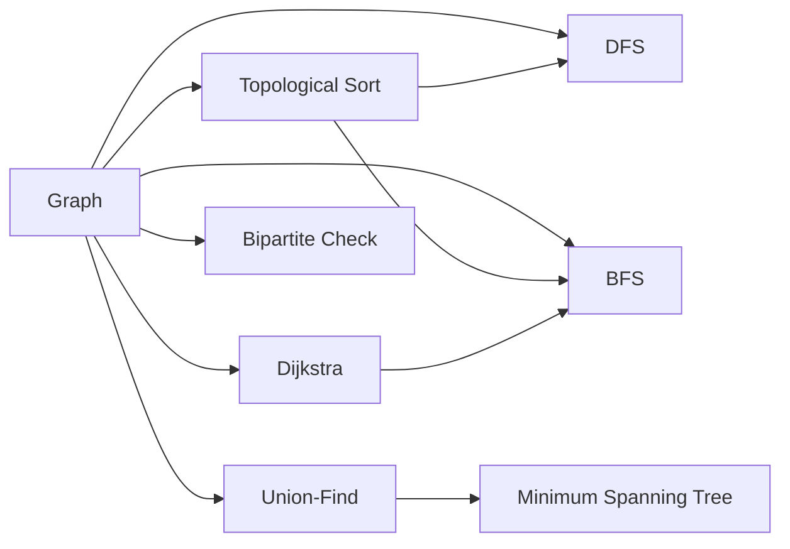
```mermaid
graph LR
  G[Graph] --> DFS & BFS
  G --> UF[Union-Find]
  G --> Dijk[Dijkstra]
  G --> Topo[Topological Sort]
  G --> Bipartite[Bipartite Check]
  Topo --> DFS
  Topo --> BFS
  Dijk --> BFS
  UF --> MST[Minimum Spanning Tree]
```

| Subcategory                             | Path                                                                              |
| --------------------------------------- | --------------------------------------------------------------------------------- |
| BFS traversal                           | [数据结构/Graph/BFS遍历](./数据结构/Graph/BFS遍历)                                |
| DFS traversal                           | [数据结构/Graph/DFS遍历](./数据结构/Graph/DFS遍历)                                |
| Union-Find (Disjoint Set)               | [数据结构/Graph/并查集(Union Find)](<./数据结构/Graph/并查集(Union%20Find)>)      |
| Shortest / longest path (Dijkstra, BFS) | [数据结构/Graph/最短(长)路径](<./数据结构/Graph/最短(长)路径>)                    |
| Cycle detection + topological sort      | [数据结构/Graph/环检测\_topologicalSort](./数据结构/Graph/环检测_topologicalSort) |
| Bipartite graph                         | [数据结构/Graph/二分图](./数据结构/Graph/二分图)                                  |
| Kruskal MST                             | [数据结构/Graph/Kruskal最小生成树算法](./数据结构/Graph/Kruskal最小生成树算法)    |
| DFS in graph                            | [算法思想/DFS/DFS in 图](./算法思想/DFS/DFS%20in%20图)                            |
| BFS in graph                            | [算法思想/BFS/BFS in 图](./算法思想/BFS/BFS%20in%20图)                            |

### Stack & Queue

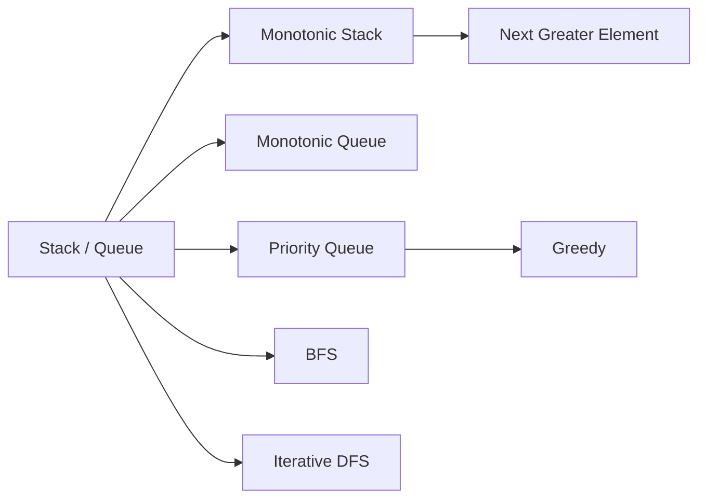
```mermaid
graph LR
  SQ[Stack / Queue] --> MonoStack[Monotonic Stack]
  SQ --> MonoQueue[Monotonic Queue]
  SQ --> PQ[Priority Queue]
  SQ --> BFS
  SQ --> DFS[Iterative DFS]
  MonoStack --> NextGreater[Next Greater Element]
  PQ --> Greedy
```

| Subcategory                 | Path                                                                                                       |
| --------------------------- | ---------------------------------------------------------------------------------------------------------- |
| Classic stack problems      | [数据结构/Stack&Queue/传统Stack题目](./数据结构/Stack&Queue/传统Stack题目)                                 |
| Classic queue problems      | [数据结构/Stack&Queue/传统Queue题目](./数据结构/Stack&Queue/传统Queue题目)                                 |
| Monotonic stack             | [数据结构/Stack&Queue/MonotonicStack*单调栈*题目](./数据结构/Stack&Queue/MonotonicStack_单调栈_题目)       |
| Monotonic queue             | [数据结构/Stack&Queue/MonotonicQueue*单调队列*题目](./数据结构/Stack&Queue/MonotonicQueue_单调队列_题目)   |
| Priority queue (heap-based) | [数据结构/Stack&Queue/PriorityQueue*优先级队列*题目](./数据结构/Stack&Queue/PriorityQueue_优先级队列_题目) |

### Linked List

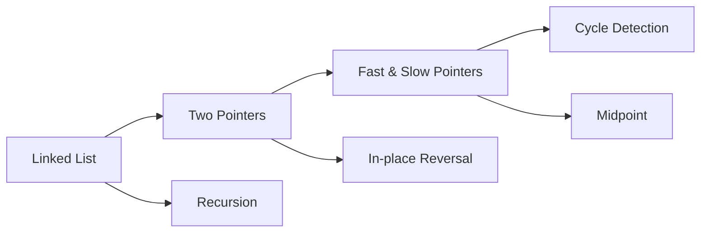
```mermaid
graph LR
  LL[Linked List] --> TP[Two Pointers]
  LL --> Recursion
  TP --> FastSlow[Fast & Slow Pointers]
  TP --> Reversal[In-place Reversal]
  FastSlow --> CycleDetect[Cycle Detection]
  FastSlow --> Midpoint
```

| Subcategory                   | Path                                                                       |
| ----------------------------- | -------------------------------------------------------------------------- |
| All linked list problems      | [数据结构/LinkedList/List基础题](./数据结构/LinkedList/List基础题)         |
| Two-pointer patterns on lists | [算法思想/2 Pointers/同向2Pointers](./算法思想/2%20Pointers/同向2Pointers) |

### Array / Prefix Sum

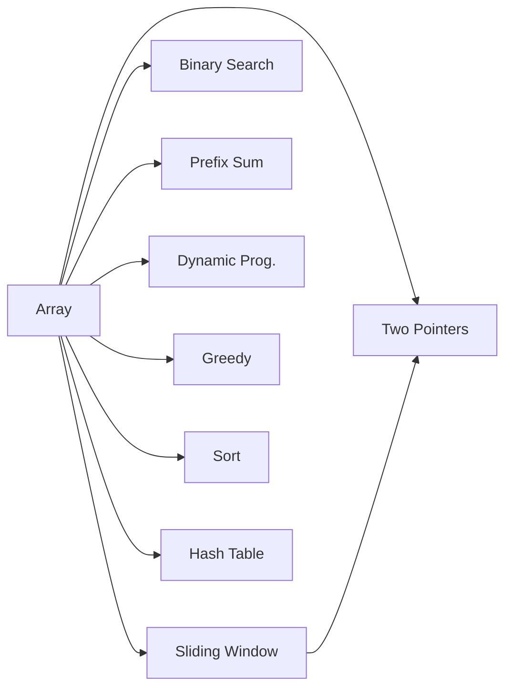
```mermaid
graph LR
  A[Array] --> TP[Two Pointers]
  A --> SW[Sliding Window]
  A --> BS[Binary Search]
  A --> PS[Prefix Sum]
  A --> DP[Dynamic Prog.]
  A --> Greedy
  A --> Sort
  A --> Hash[Hash Table]
  SW --> TP
```

| Subcategory                                         | Path                                                                                                                                                                           |
| --------------------------------------------------- | ------------------------------------------------------------------------------------------------------------------------------------------------------------------------------ |
| 1D prefix sum array                                 | [数据结构/Array - Prefix*Sum (前缀和*数组)/一维 - 前缀和数组(preSum Array)](<./数据结构/Array%20-%20Prefix_Sum%20(前缀和_数组)/一维%20-%20前缀和数组(preSum%20Array)>)         |
| 1D prefix product array                             | [数据结构/Array - Prefix*Sum (前缀和*数组)/一维 - 前缀积数组(preProduce Array)](<./数据结构/Array%20-%20Prefix_Sum%20(前缀和_数组)/一维%20-%20前缀积数组(preProduce%20Array)>) |
| 2D prefix sum matrix                                | [数据结构/Array - Prefix*Sum (前缀和*数组)/二维 - 前缀和矩阵(preSum Matrix)](<./数据结构/Array%20-%20Prefix_Sum%20(前缀和_数组)/二维%20-%20前缀和矩阵(preSum%20Matrix)>)       |
| Interval problems                                   | [数据结构/Array基础题/区间题](./数据结构/Array基础题/区间题)                                                                                                                   |
| Circular array problems                             | [数据结构/Array基础题/环形数组(逻辑上的环形)](<./数据结构/Array基础题/环形数组(逻辑上的环形)>)                                                                                 |
| Sliding window                                      | [算法思想/2 Pointers/同向2Pointers](./算法思想/2%20Pointers/同向2Pointers)                                                                                                     |
| Binary search on arrays                             | [算法思想/Searching/Binary Search](./算法思想/Searching/Binary%20Search)                                                                                                       |
| Opposite-direction two pointers (N-sum, palindrome) | [算法思想/2 Pointers/相向2Pointers](./算法思想/2%20Pointers/相向2Pointers)                                                                                                     |

### Matrix

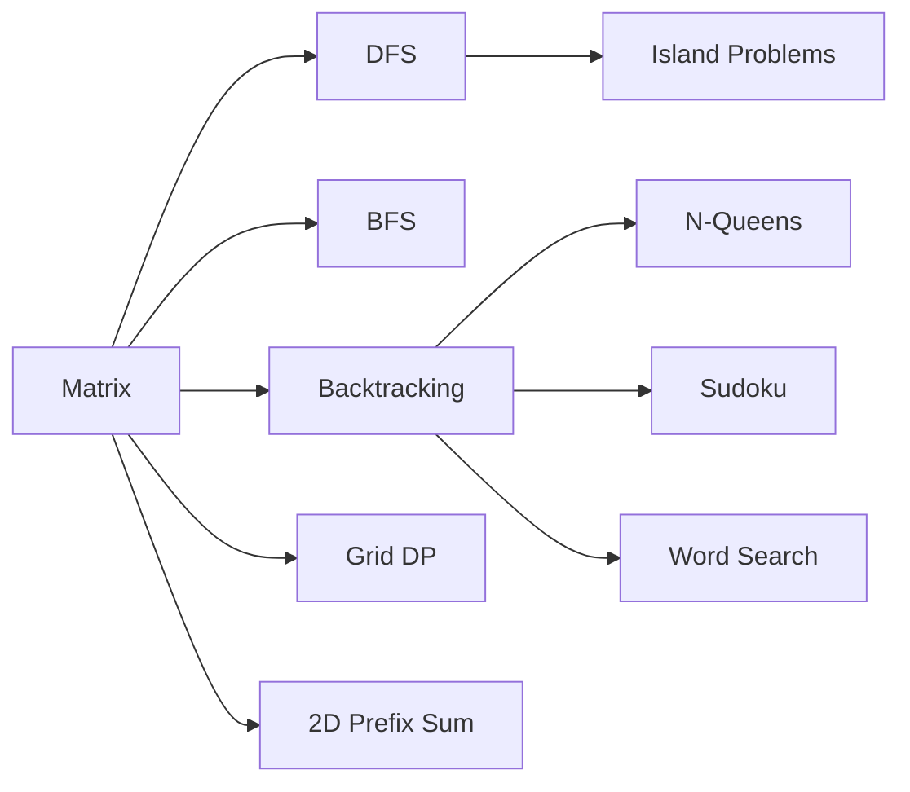
```mermaid
graph LR
  M[Matrix] --> DFS & BFS
  M --> BK[Backtracking]
  M --> DP[Grid DP]
  M --> PS[2D Prefix Sum]
  DFS --> Islands[Island Problems]
  BK --> NQ[N-Queens]
  BK --> Sudoku
  BK --> WS[Word Search]
```

| Subcategory                 | Path                                                               |
| --------------------------- | ------------------------------------------------------------------ |
| Island problems (DFS)       | [数据结构/矩阵/DFS岛屿问题](./数据结构/矩阵/DFS岛屿问题)           |
| Shortest path in grid (BFS) | [数据结构/矩阵/BFS路径问题](./数据结构/矩阵/BFS路径问题)           |
| N-Queens                    | [数据结构/矩阵/N皇后](./数据结构/矩阵/N皇后)                       |
| Word Search                 | [数据结构/矩阵/wordSearch](./数据结构/矩阵/wordSearch)             |
| Sudoku solver               | [数据结构/矩阵/数独](./数据结构/矩阵/数独)                         |
| 2D prefix sum               | [数据结构/矩阵/前缀和PreSum矩阵](./数据结构/矩阵/前缀和PreSum矩阵) |
| DFS in matrix               | [算法思想/DFS/DFS in 矩阵](./算法思想/DFS/DFS%20in%20矩阵)         |
| BFS in matrix               | [算法思想/BFS/BFS in 矩阵](./算法思想/BFS/BFS%20in%20矩阵)         |

### Heap

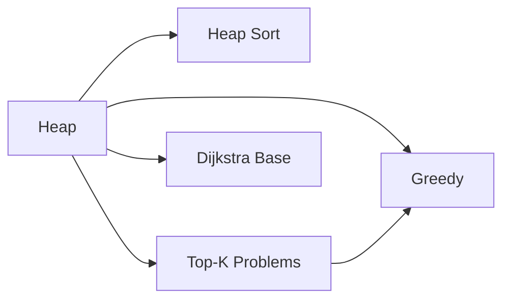
```mermaid
graph LR
  H[Heap] --> Greedy
  H --> Sort[Heap Sort]
  H --> TopK[Top-K Problems]
  H --> Dijkstra[Dijkstra Base]
  TopK --> Greedy
```

| Subcategory       | Path                                     |
| ----------------- | ---------------------------------------- |
| All heap problems | [数据结构/Heap题目](./数据结构/Heap题目) |

### Trie

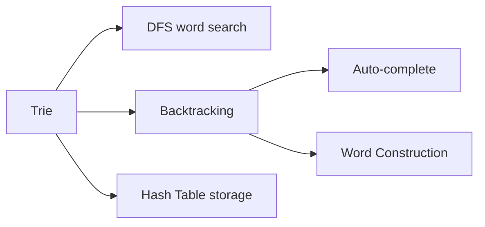
```mermaid
graph LR
  T[Trie] --> DFS[DFS word search]
  T --> BK[Backtracking]
  T --> Hash[Hash Table storage]
  BK --> AutoComplete[Auto-complete]
  BK --> WordConstruct[Word Construction]
```

| Subcategory       | Path                                                               |
| ----------------- | ------------------------------------------------------------------ |
| All trie problems | [数据结构/Tire(前缀树，字典树）](./数据结构/Tire(前缀树，字典树）) |

### String

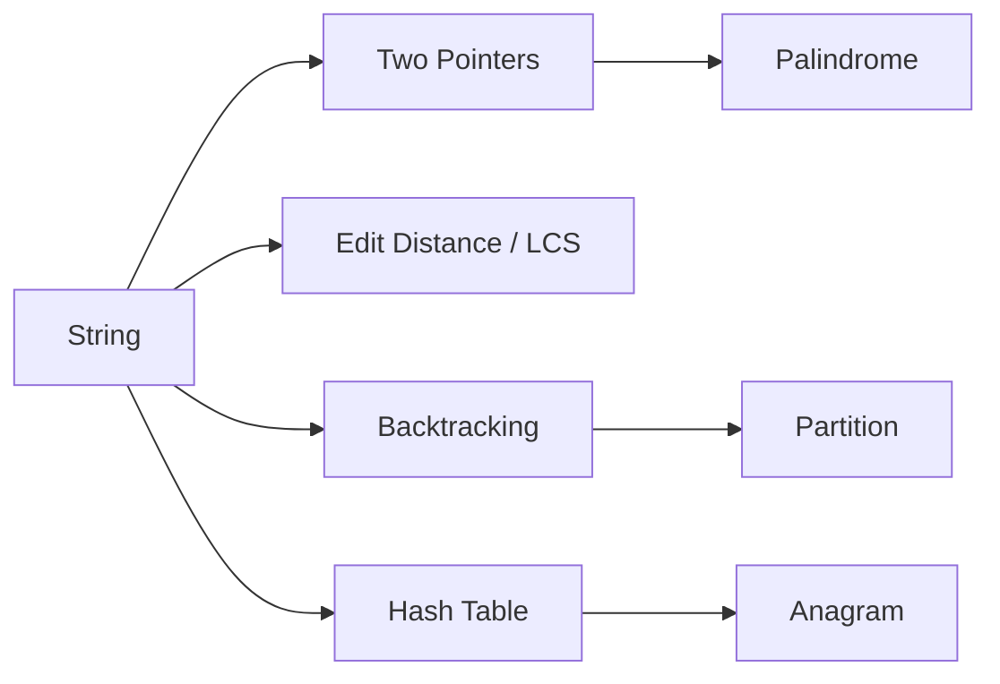
```mermaid
graph LR
  S[String] --> TP[Two Pointers]
  S --> DP[Edit Distance / LCS]
  S --> BK[Backtracking]
  S --> Hash[Hash Table]
  TP --> Palindrome
  BK --> Partition
  Hash --> Anagram
```

| Subcategory         | Path                                                           |
| ------------------- | -------------------------------------------------------------- |
| All string problems | [数据结构/String](./数据结构/String)                           |
| DFS in string       | [算法思想/DFS/DFS in String](./算法思想/DFS/DFS%20in%20String) |
| BFS in string       | [算法思想/BFS/BFS in 字符串](./算法思想/BFS/BFS%20in%20字符串) |

---

## Algorithm Techniques

### DFS

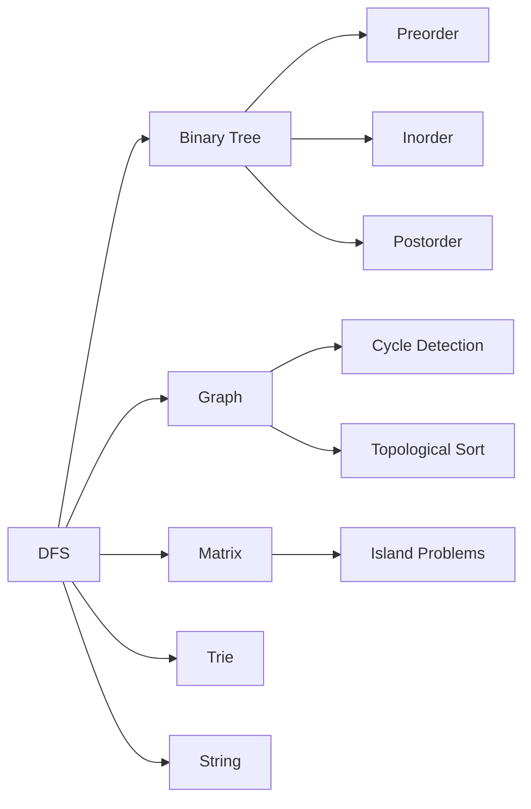
```mermaid
graph LR
  DFS --> BT[Binary Tree]
  DFS --> G[Graph]
  DFS --> Mat[Matrix]
  DFS --> Trie
  DFS --> Str[String]
  BT --> Pre[Preorder] & In[Inorder] & Post[Postorder]
  G  --> Cycle[Cycle Detection] & Topo[Topological Sort]
  Mat --> Islands[Island Problems]
```

| Subcategory        | Path                                                               |
| ------------------ | ------------------------------------------------------------------ |
| DFS in binary tree | [算法思想/DFS/DFS in 二叉树 ](./算法思想/DFS/DFS%20in%20二叉树%20) |
| DFS in graph       | [算法思想/DFS/DFS in 图](./算法思想/DFS/DFS%20in%20图)             |
| DFS in matrix      | [算法思想/DFS/DFS in 矩阵](./算法思想/DFS/DFS%20in%20矩阵)         |
| DFS in n-ary tree  | [算法思想/DFS/DFS in 多叉树](./算法思想/DFS/DFS%20in%20多叉树)     |
| DFS in string      | [算法思想/DFS/DFS in String](./算法思想/DFS/DFS%20in%20String)     |

### BFS

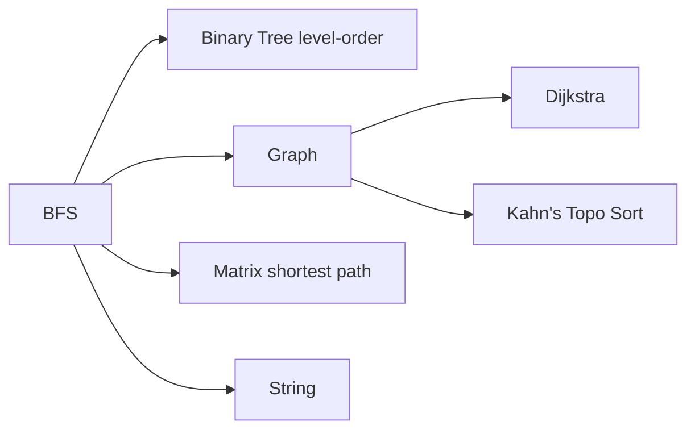
```mermaid
graph LR
  BFS --> BT[Binary Tree level-order]
  BFS --> G[Graph]
  BFS --> Mat[Matrix shortest path]
  BFS --> Str[String]
  G --> Dijk[Dijkstra]
  G --> Topo[Kahn's Topo Sort]
```

| Subcategory        | Path                                                               |
| ------------------ | ------------------------------------------------------------------ |
| BFS on binary tree | [算法思想/BFS/BFS 遍历 二叉树](./算法思想/BFS/BFS%20遍历%20二叉树) |
| BFS on graph       | [算法思想/BFS/BFS in 图](./算法思想/BFS/BFS%20in%20图)             |
| BFS on matrix      | [算法思想/BFS/BFS in 矩阵](./算法思想/BFS/BFS%20in%20矩阵)         |
| BFS on string      | [算法思想/BFS/BFS in 字符串](./算法思想/BFS/BFS%20in%20字符串)     |

### Two Pointers

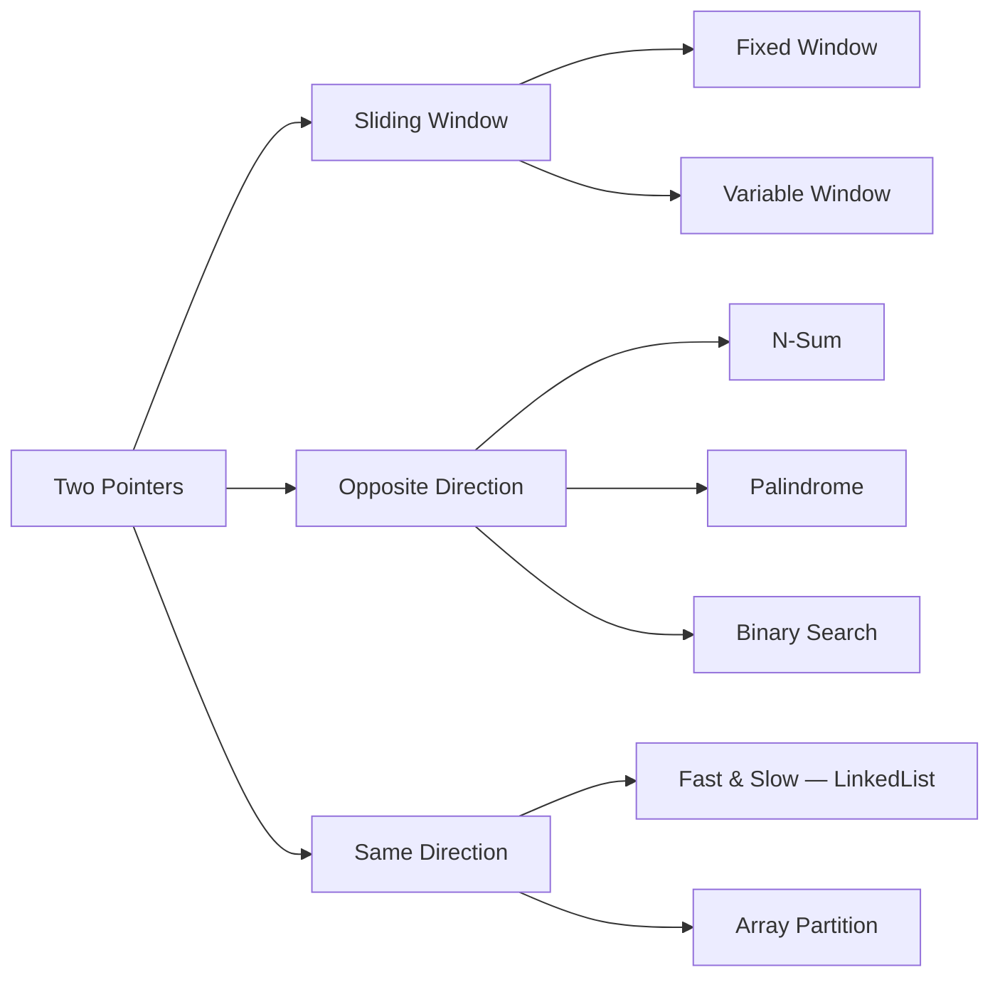
```mermaid
graph LR
  TP[Two Pointers] --> SW[Sliding Window]
  TP --> Opp[Opposite Direction]
  TP --> Same[Same Direction]
  SW --> Fixed[Fixed Window]
  SW --> Variable[Variable Window]
  Opp --> NSum[N-Sum]
  Opp --> Palindrome
  Opp --> BS[Binary Search]
  Same --> FastSlow[Fast & Slow — LinkedList]
  Same --> Partition[Array Partition]
```

| Subcategory                                         | Path                                                                       |
| --------------------------------------------------- | -------------------------------------------------------------------------- |
| Same-direction pointers (fast/slow, sliding window) | [算法思想/2 Pointers/同向2Pointers](./算法思想/2%20Pointers/同向2Pointers) |
| Opposite-direction pointers (binary search, N-sum)  | [算法思想/2 Pointers/相向2Pointers](./算法思想/2%20Pointers/相向2Pointers) |
| Mixed / unknown pattern                             | [算法思想/2 Pointers/未知2Pointers](./算法思想/2%20Pointers/未知2Pointers) |

### Dynamic Programming

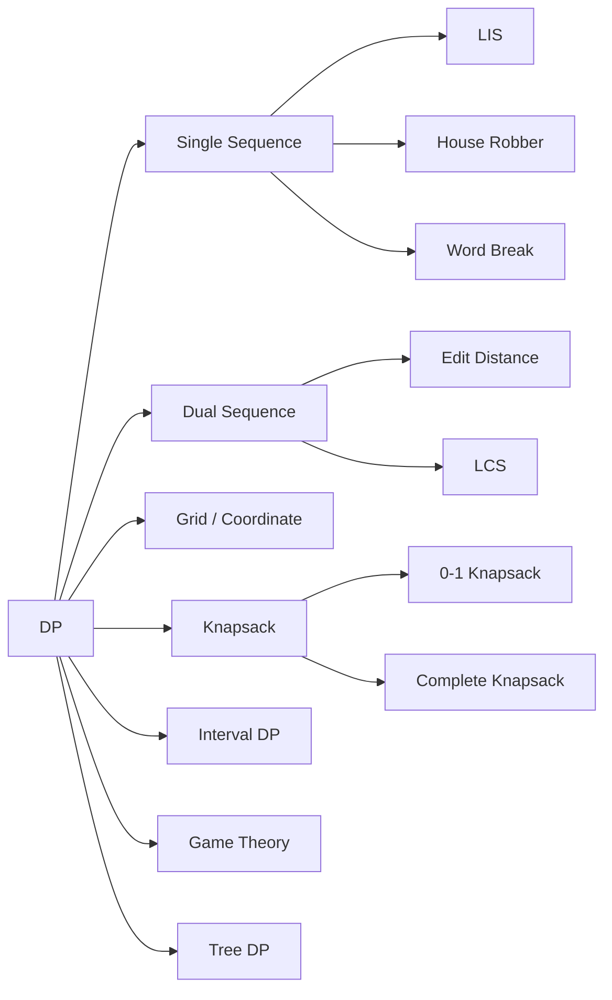
```mermaid
graph LR
  DP --> Single[Single Sequence]
  DP --> Dual[Dual Sequence]
  DP --> Grid[Grid / Coordinate]
  DP --> Knapsack[Knapsack]
  DP --> Interval[Interval DP]
  DP --> Game[Game Theory]
  DP --> Tree[Tree DP]
  Single --> LIS[LIS] & Robber[House Robber] & WB[Word Break]
  Dual --> Edit[Edit Distance] & LCS
  Knapsack --> K01[0-1 Knapsack] & KComp[Complete Knapsack]
```

| Subcategory                                         | Path                                                                                                 |
| --------------------------------------------------- | ---------------------------------------------------------------------------------------------------- |
| Single-sequence DP (LIS, House Robber, Word Break…) | [算法思想/Dynamic Programming/单序列 (30%)](<./算法思想/Dynamic%20Programming/单序列%20(30%25)>)     |
| Dual-sequence DP (Edit Distance, LCS…)              | [算法思想/Dynamic Programming/双序列 (30%)](<./算法思想/Dynamic%20Programming/双序列%20(30%25)>)     |
| Grid / coordinate DP                                | [算法思想/Dynamic Programming/坐标类 (15%)](<./算法思想/Dynamic%20Programming/坐标类%20(15%25)>)     |
| Knapsack (0-1 + complete)                           | [算法思想/Dynamic Programming/背包问题 (10%)](<./算法思想/Dynamic%20Programming/背包问题%20(10%25)>) |
| Interval DP                                         | [算法思想/Dynamic Programming/区间类 (5%)](<./算法思想/Dynamic%20Programming/区间类%20(5%25)>)       |
| Game theory DP                                      | [算法思想/Dynamic Programming/博弈类](./算法思想/Dynamic%20Programming/博弈类)                       |
| Tree DP                                             | [算法思想/Dynamic Programming/DP in Trees](./算法思想/Dynamic%20Programming/DP%20in%20Trees)         |
| Palindrome DP                                       | [算法思想/Dynamic Programming/回文串](./算法思想/Dynamic%20Programming/回文串)                       |
| Stock problems                                      | [算法思想/Dynamic Programming/股票问题](./算法思想/Dynamic%20Programming/股票问题)                   |

### Backtracking

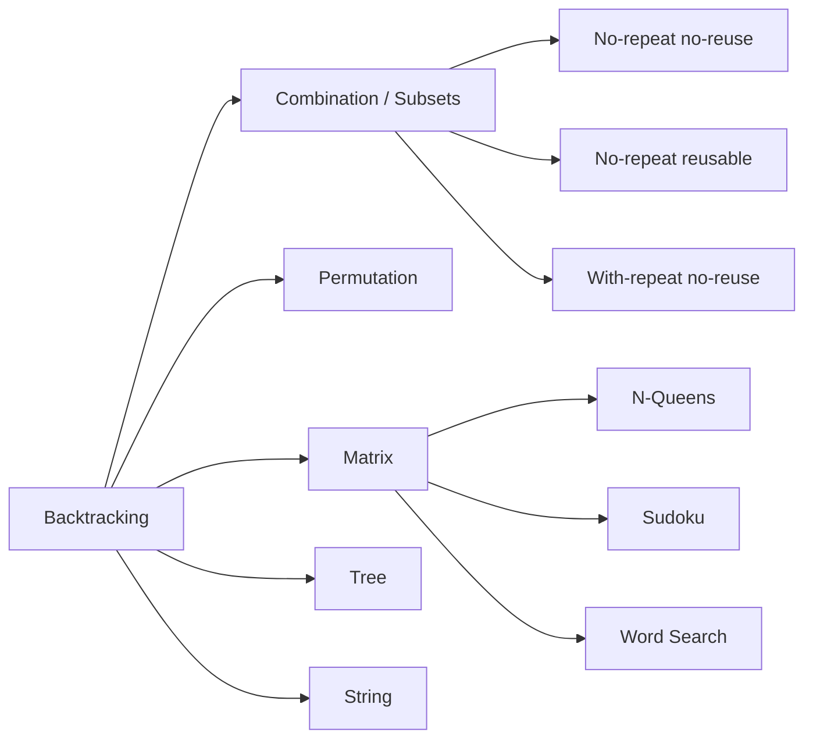
```mermaid
graph LR
  BK[Backtracking] --> Comb[Combination / Subsets]
  BK --> Perm[Permutation]
  BK --> Mat[Matrix]
  BK --> Tree
  BK --> Str[String]
  Comb --> NoRepeat[No-repeat no-reuse]
  Comb --> Reuse[No-repeat reusable]
  Comb --> Repeat[With-repeat no-reuse]
  Mat --> NQ[N-Queens] & Sudoku & WS[Word Search]
```

| Subcategory             | Path                                             |
| ----------------------- | ------------------------------------------------ |
| Combination & subsets   | [算法思想/Backtracking](./算法思想/Backtracking) |
| Permutation variants    | [算法思想/Backtracking](./算法思想/Backtracking) |
| Tree-based backtracking | [算法思想/Backtracking](./算法思想/Backtracking) |

### Greedy

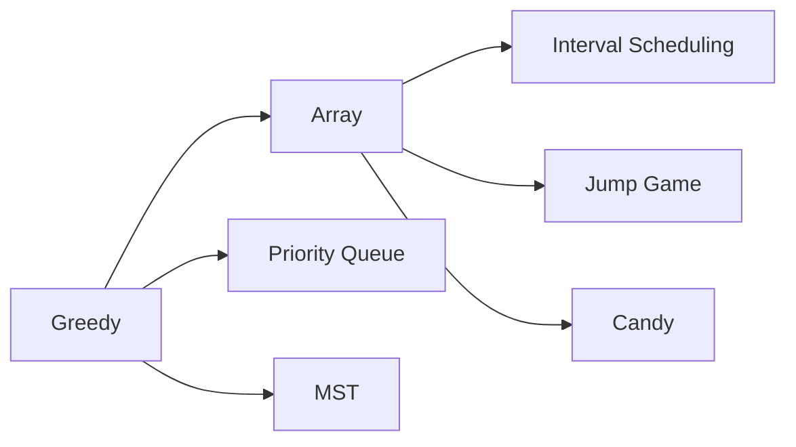
```mermaid
graph LR
  Gr[Greedy] --> Arr[Array]
  Gr --> Heap[Priority Queue]
  Gr --> Graph[MST]
  Arr --> Interval[Interval Scheduling]
  Arr --> Jump[Jump Game]
  Arr --> Candy
```

| Subcategory         | Path                                                       |
| ------------------- | ---------------------------------------------------------- |
| All greedy problems | [算法思想/Greddy Algorithm](./算法思想/Greddy%20Algorithm) |

### Sorting

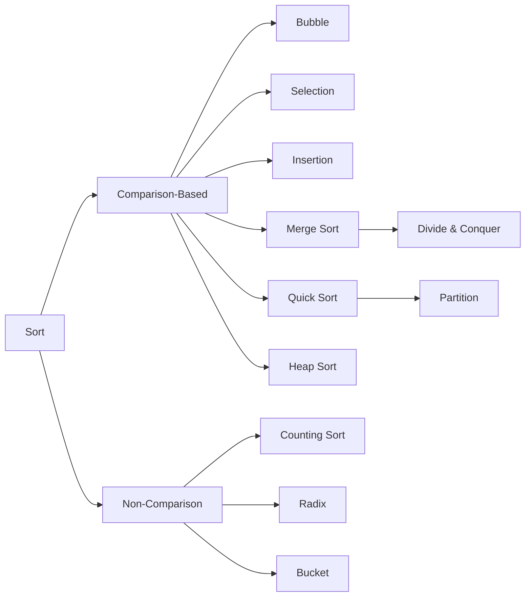
```mermaid
graph LR
  Sort --> Comparison[Comparison-Based]
  Sort --> NonComp[Non-Comparison]
  Comparison --> Bubble & Selection & Insertion
  Comparison --> Merge[Merge Sort] & Quick[Quick Sort] & HeapSort[Heap Sort]
  NonComp --> Counting[Counting Sort] & Radix & Bucket
  Merge --> DAC[Divide & Conquer]
  Quick --> Partition
```

| Subcategory                 | Path                             |
| --------------------------- | -------------------------------- |
| All sorting implementations | [算法思想/Sort](./算法思想/Sort) |

### Hash Table

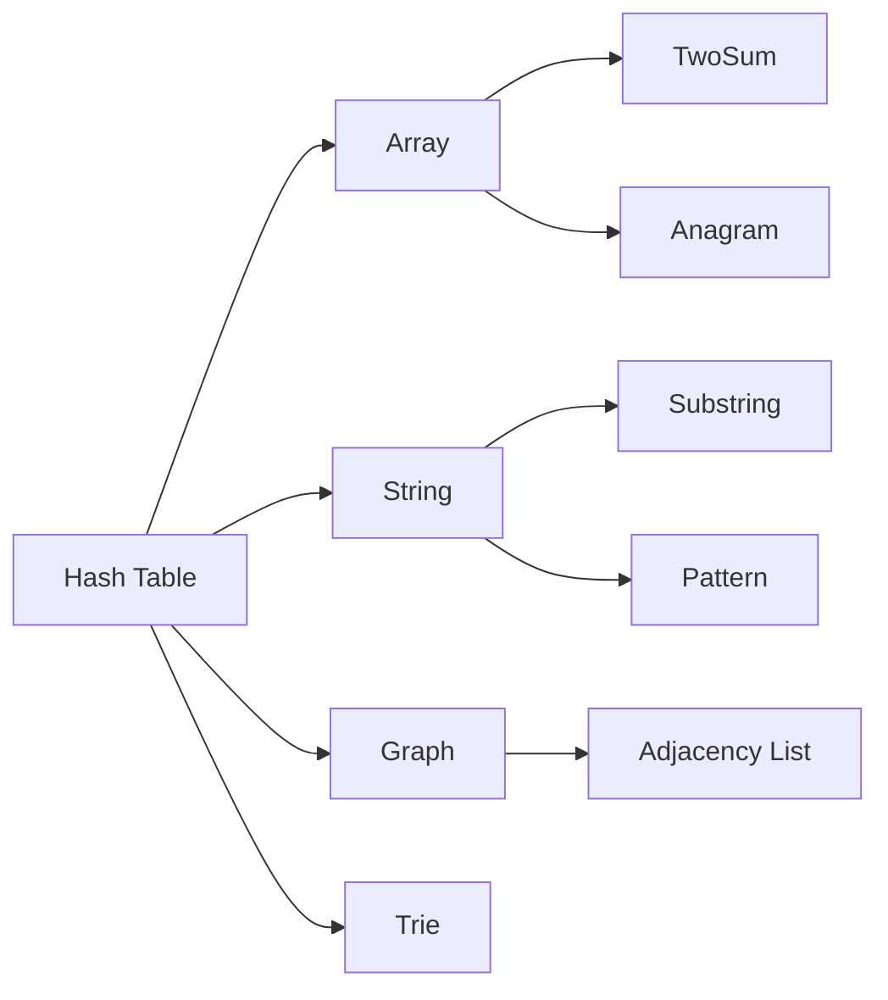
```mermaid
graph LR
  Hash[Hash Table] --> Array
  Hash --> String
  Hash --> Graph
  Hash --> Trie
  Array --> TwoSum & Anagram
  String --> Substring & Pattern
  Graph --> AdjList[Adjacency List]
```

| Subcategory                       | Path                                                   |
| --------------------------------- | ------------------------------------------------------ |
| All hash table technique problems | [算法思想/Hashtable 技巧](./算法思想/Hashtable%20技巧) |

---

### Binary Search

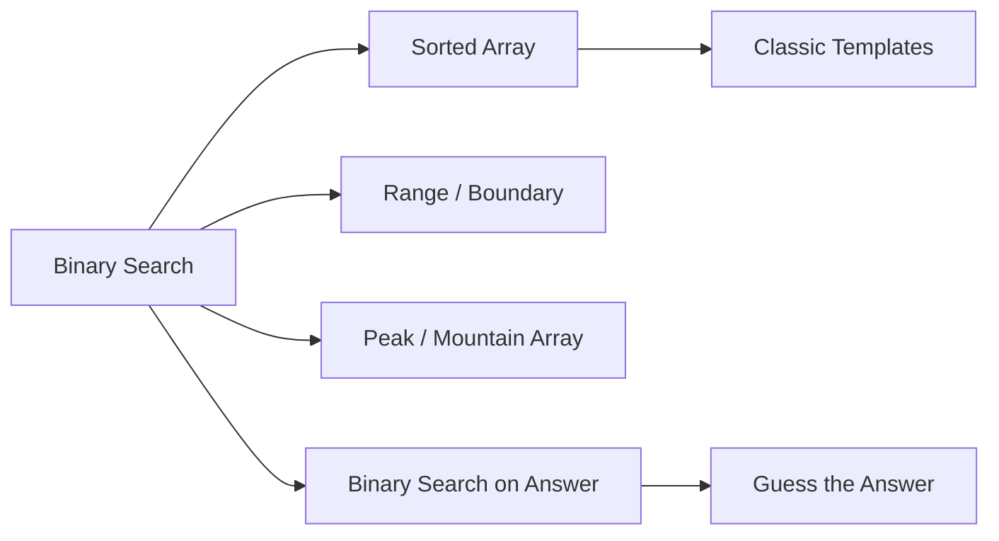
```mermaid
graph LR
  BS[Binary Search] --> Arr[Sorted Array]
  BS --> Range[Range / Boundary]
  BS --> Peak[Peak / Mountain Array]
  BS --> Answer[Binary Search on Answer]
  Arr --> Classic[Classic Templates]
  Answer --> Guess[Guess the Answer]
```

| Subcategory                     | Path                                                                       |
| ------------------------------- | -------------------------------------------------------------------------- |
| All binary search problems      | [算法思想/Searching/Binary Search](./算法思想/Searching/Binary%20Search)   |
| Same-direction pointer patterns | [算法思想/2 Pointers/相向2Pointers](./算法思想/2%20Pointers/相向2Pointers) |

### Recursion

```mermaid
graph LR
  Rec[Recursion] --> Tree[Binary Tree]
  Rec --> LL[Linked List]
  Rec --> Divide[Divide & Conquer]
  Rec --> Math[Math Problems]
  Tree --> DFS[DFS patterns]
  Divide --> MergeSort[Merge Sort]
```

| Subcategory            | Path                                       |
| ---------------------- | ------------------------------------------ |
| All recursion problems | [算法思想/Recursion](./算法思想/Recursion) |
