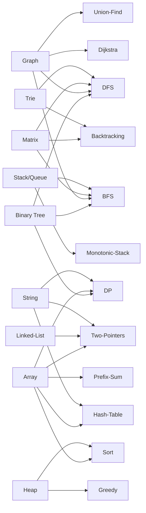

# DataStructure-Algo

1,500+ LeetCode solutions in JavaScript, organized by data structure and algorithm technique.

> **[→ Open Interactive Knowledge Graph](./graph.html)** — drag nodes, hover to highlight connections

---

## Overview

How data structures and algorithm techniques connect across this repo:

---

## Quick Navigation

**Data Structures**
[Binary Tree](#binary-tree--94-files) · [Graph](#graph--43-files) · [Stack & Queue](#stack--queue--61-files) · [Linked List](#linked-list--31-files) · [Array / Prefix Sum](#array--prefix-sum--34-files) · [Matrix](#matrix--38-files) · [Heap](#heap--19-files) · [Trie](#trie--8-files) · [String](#string--7-files)

**Algorithm Techniques**
[DFS](#dfs--113-files) · [BFS](#bfs--52-files) · [Two Pointers](#two-pointers--142-files) · [Dynamic Programming](#dynamic-programming--98-files) · [Backtracking](#backtracking--59-files) · [Greedy](#greedy--25-files) · [Sorting](#sorting--20-files) · [Hash Table](#hash-table--31-files)

**[LeetCode Index](#leetcode-index)**

---
